## RoboSats

Guida su come utilizzare RoboSats, il sito di scambio P2P di Bitcoin più veloce e senza KYC che esiste!

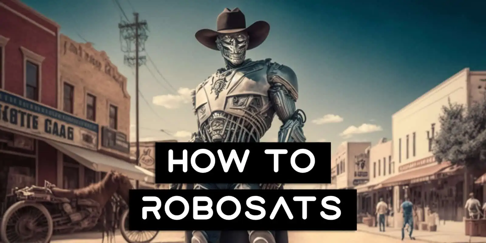

Questa guida ti accompagnerà passo dopo passo nell'utilizzo di RoboSats per acquistare e vendere Bitcoin in modo anonimo e sicuro. Imparerai come generare il tuo account, esplorare i vari ordini, acquistare, vendere e gestire possibili controversie.

Questa guida é stata tradotta dal sito ufficiale di robosats, se volete visualizzarla in altre linque potete dare un occhiata [quá](https://learn.robosats.com/read/en/). Se siete utenti android esiste anche un app di robosats scaricabile da [Github](https://github.com/RoboSats/robosats/releases) o [Fdroid](https://apt.izzysoft.de/fdroid/index/apk/com.robosats) se aggiungete il repository di Izzyondroid.

## Indice

- [Introduzione](#introduzione)
- [Generazione dell'Avatar](#generazione-dellavatar)
- [Recupero di un Robot](#recupero-di-un-robot)
- [Esplorazione del Libro degli Ordini](#esplorazione-del-libro-degli-ordini)
- [Guida 1: Accettare un Ordine come Acquirente](#guida-1-accettare-un-ordine-come-acquirente)
- [Guida 2: Creare un Ordine come Venditore](#guida-2-creare-un-ordine-come-venditore)
- [Annullamento Collaborativo](#annullamento-collaborativo)
- [Controversie](#controversie)
- [Conclusioni](#conclusioni)

## Introduzione {#introduzione style="color: greenyellow;"}

RoboSats è una piattaforma P2P focalizzata sulla facilità d'uso e sulla privacy degli utenti. La piattaforma è completamente intuitiva, quindi potresti pensare che un tutorial non sia necessario. Tuttavia, è utile sentirsi a proprio agio durante l'acquisto dei nostri amati satoshi per evitare possibili errori. Dopo tutto, gli scambi Bitcoin P2P possono essere spaventosi! Non temere, RoboSats rende tutto molto semplice! :D

Questo documento presenta due guide complete:

1. Come acquirente che accetta un ordine.
2. Come venditore che crea un ordine.

Dato che la piattaforma spiega all'utente esattamente tutto nei menu, dedicheremo alcune righe a trucchi e consigli per un acquisto sicuro.

## Generazione dell'Avatar {#generazione-dellavatar style="color: greenyellow;"}

RoboSats aiuta gli utenti a preservare la loro privacy utilizzando avatar generati al momento in ogni trade, quest'ultimi super facili da generare! Sono praticamente delle identitá generabili in modo da 
avere un account diverso per ogni volta che accquistate o vendete sats.

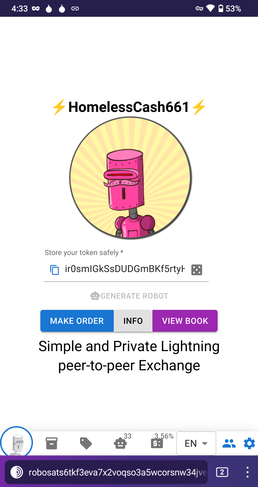

RoboSats ti dà il benvenuto immediatamente con il tuo avatar robot unico. Il robot è generato deterministicamente in base al token che vedi sotto di esso. Questo token è tutto ciò di cui hai bisogno per recuperare l'account in futuro, quindi assicurati di salvarlo in modo sicuro!

I token sono generati nel tuo browser. Tuttavia, se non ti fidi della casualità della tua macchina, puoi anche inserire entropia manualmente.

Clicca su genera per creare il tuo primo account su Robosats!

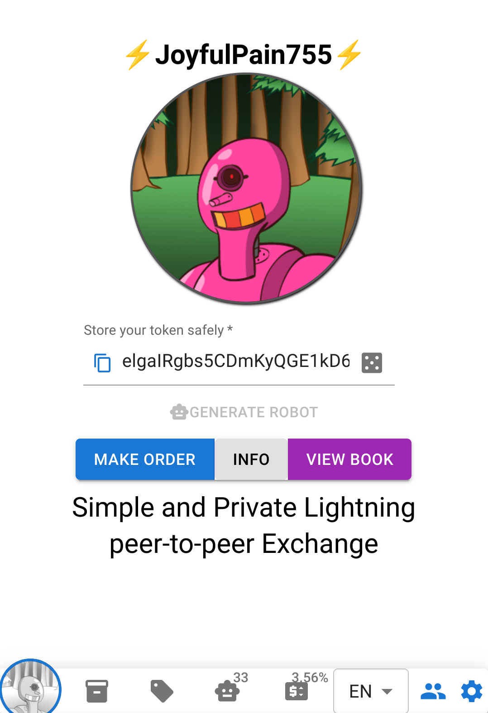

 Il token rimarrà nella memoria del tuo browser per un po' di tempo, quindi potresti ancora avere la possibilità di copiarlo più tardi toccando l'icona del profilo nell'angolo in basso a sinistra. Tuttavia, il tuo browser dimenticherà il token se aggiorni o chiudi la pagina!

È meglio scriverlo su carta... ma è un sacco di lavoro!! Molto spesso è sufficiente copiarlo negli appunti e salvarlo da qualche altra parte. Se il tuo browser si blocca, la batteria del telefono si esaurisce o perdi la connessione durante l'acquisto, avrai bisogno del token per accedere nuovamente e continuare lo scambio!

## Recupero di un Robot {#recupero-di-un-robot style="color: greenyellow;"}

Per recuperare un token salvato, basta sostituire il token nella casella di testo e premere "Genera Robot". Il sito ti saluterà con "Abbiamo trovato il tuo avatar Robot. Bentornato!"

## Esplorazione del Libro degli Ordini {#esplorazione-del-libro-degli-ordini style="color: greenyellow;"}

In RoboSats puoi creare nuovi ordini o accettare ordini creati da altri. Per essere un creatore di ordini, basta cliccare su "Crea Ordine" nella homepage. Per accettare un ordine, clicca su "Visualizza ordini" per esplorare le offerte create dagli altri utenti.

Clicchiamo su "Visualizza book" e diamo un'occhiata agli ordini.

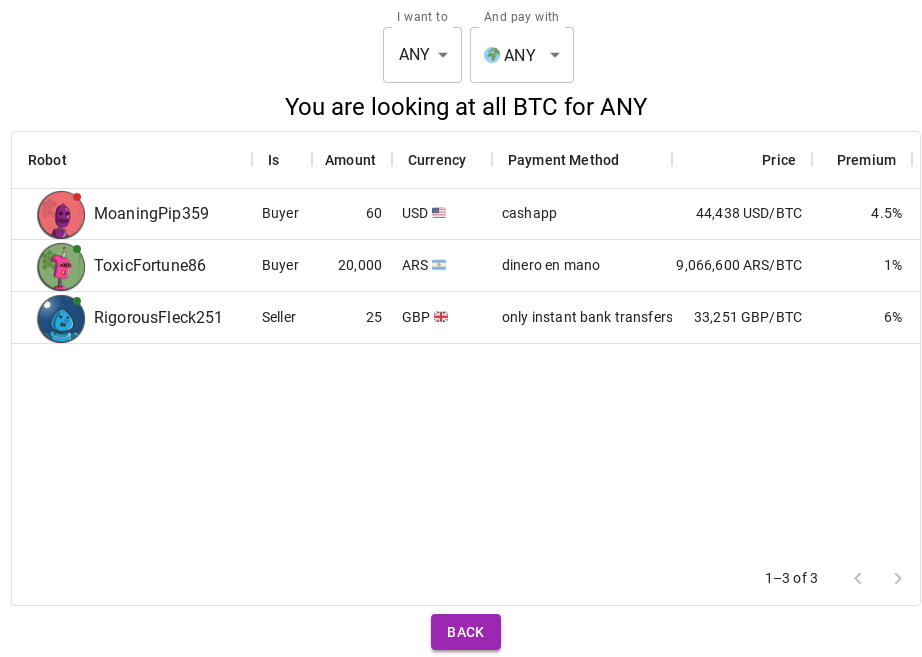

In un browser desktop, puoi vedere a colpo d'occhio tutte le informazioni rilevanti sugli ordini, così puoi decidere quale accettare. Per impostazione predefinita, il book mostrerà ordini di "QUALSIASI" tipo (acquisto e vendita) e qualsiasi tipo doi metodo di pagamento. Usa i menu a discesa in alto per selezionare le tue preferenze.

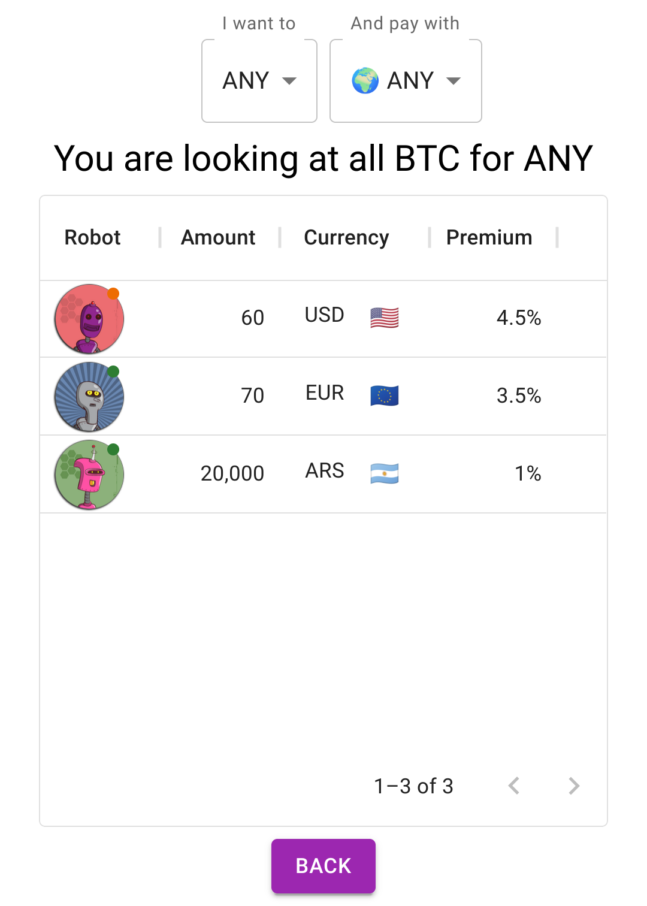

Su uno smartphone, tuttavia, non tutte le colonne si adattano allo schermo. I soprannomi, il tipo di ordine, il metodo di pagamento e il tasso di cambio sono nascosti per impostazione predefinita. Puoi toccare qualsiasi colonna e premere "Mostra colonne" per selezionare quali rendere visibili.

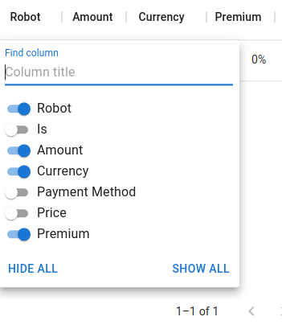

Un altro trucco è fare un tocco lungo o uno swipe:

- **Sull'Avatar**: ottieni il soprannome e lo stato di attività.
- **Sull'Importo**: ottieni se il creatore è un venditore o un acquirente.
- **Sulla Valuta**: ottieni i metodi di pagamento preferiti.
- **Sul Premio**: ottieni il tasso di cambio corrente.

Esempio di tocco lungo/scorrimento sopra la valuta:

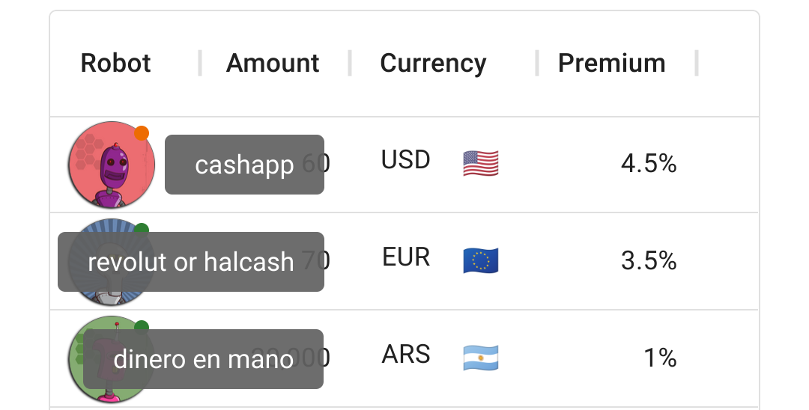

Esempio di tocco lungo/scorrimento sopra il premio:

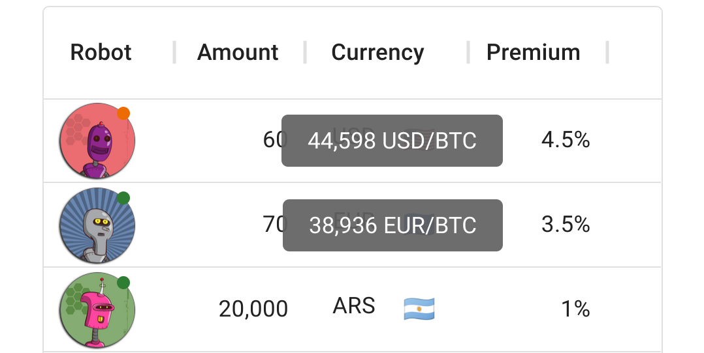

Puoi anche toccare qualsiasi ordine per vedere la pagina completa dell'ordine:

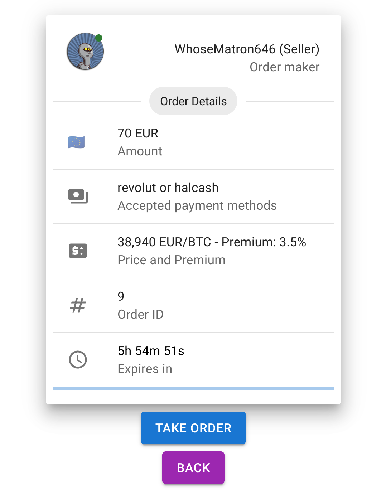

Ogni ordine ha un contatore di scadenza. Per impostazione predefinita, in RoboSats v0.1.0 i nuovi ordini rimarranno pubblici nel libro per 24 ore.

## Guida 1: Accettare un Ordine come Acquirente {#guida-1-accettare-un-ordine-come-acquirente style="color: greenyellow;"}

Quando hai deciso quale ordine accettare, basta premere il pulsante "Accetta Ordine". Vedrai la casella del contratto. Segui le indicazioni della casella del contratto fino a completare lo scambio! :)

La prima cosa è bloccare una piccola cauzione di fedeltà (solo il 3% dell'importo dello scambio per impostazione predefinita), così il venditore sa che puoi essere affidabile. I satoshi in questa cauzione rimarranno bloccati nel tuo portafoglio. Se cerchi di barare o annulli unilateralmente, perderai i satoshi bloccati nella cauzione.

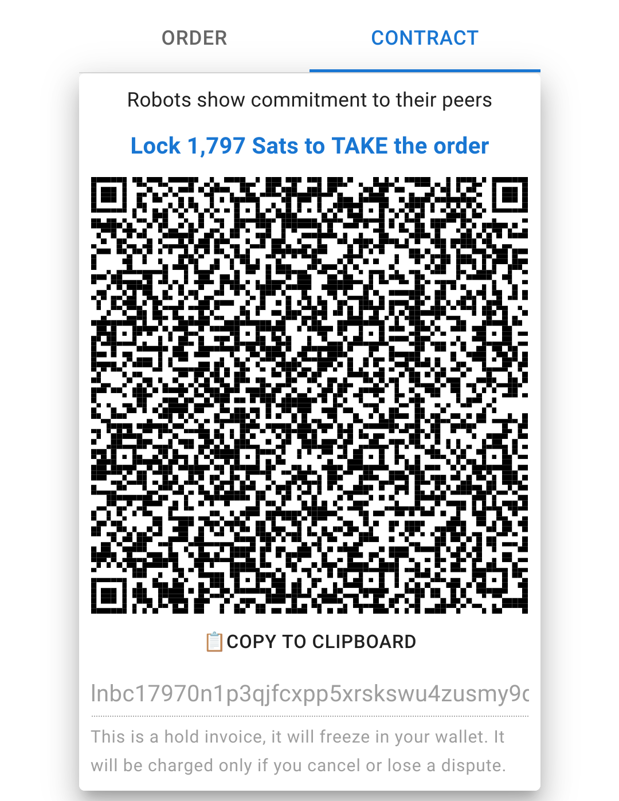

Scansiona o copia la fattura nel tuo portafoglio Lightning. Potrebbe apparire come un pagamento in transito, bloccarsi o persino sembrare che il tuo portafoglio si sia rotto. Dovresti sempre controllare sul sito di RoboSats se la cauzione è stata bloccata (il tuo portafoglio probabilmente non te lo dirà! Controlla la lista di compatibilità dei portafogli).

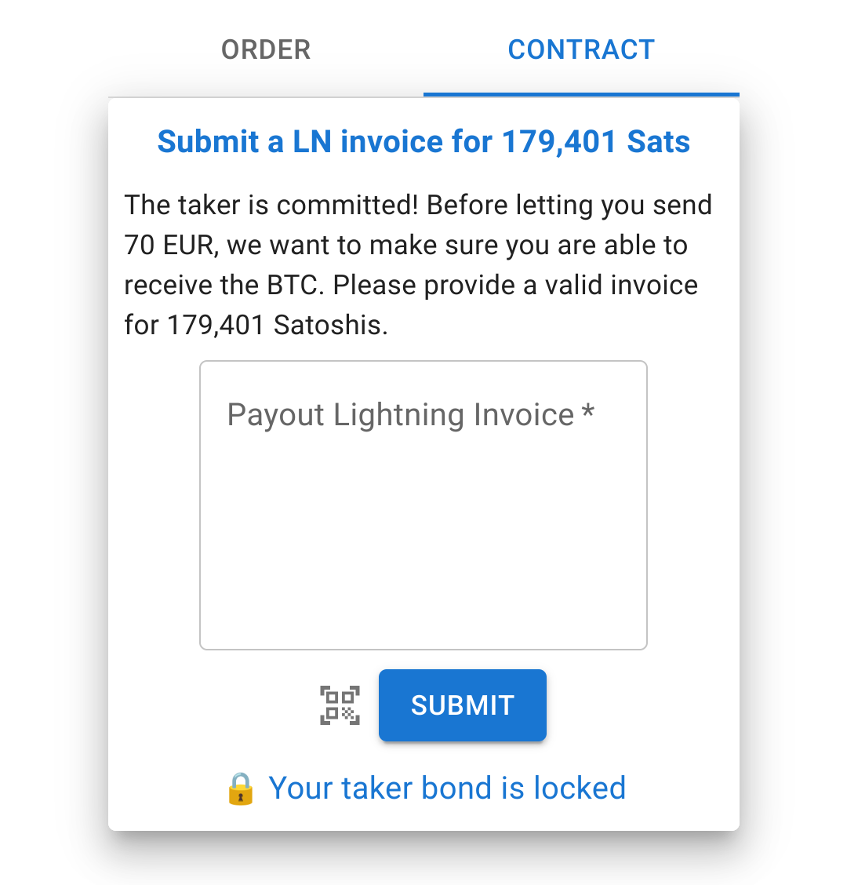

Non appena la nostra cauzione è bloccata, RoboSats ti chiederà di fornire una fattura Lightning per inviarti i satoshi. Genera una fattura con l'importo esatto nel tuo portafoglio Lightning e inviala.

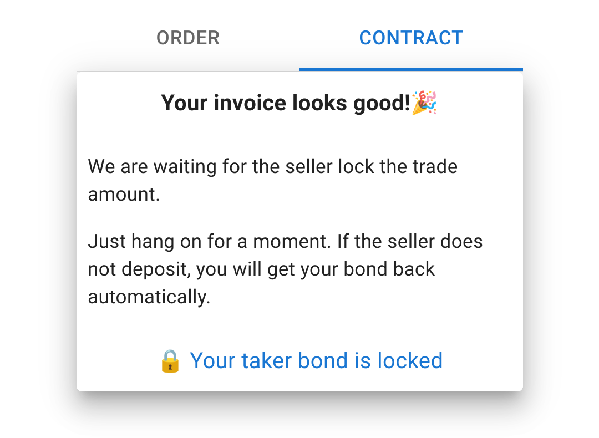

Mentre stai inviando la tua fattura di pagamento, al venditore viene chiesto di bloccare la cauzione del trade (hold invoice). Se sei più veloce di lui, dovrai aspettare. Altrimenti, potresti già essere in grado di chattare con lui.

C'è un limite di tempo di 3 ore per inviare la fattura (acquirente) e bloccare la cauzione del trade (venditore). Se il tempo scade, l'ordine scadrà e il robot che non ha seguito gli obblighi contrattuali perderà la cauzione. Questo è un meccanismo che aiuta a prevenire lo spam di ordini falsi, la perdita di tempo dei controparti e gli attacchi DDOS al libro degli ordini.

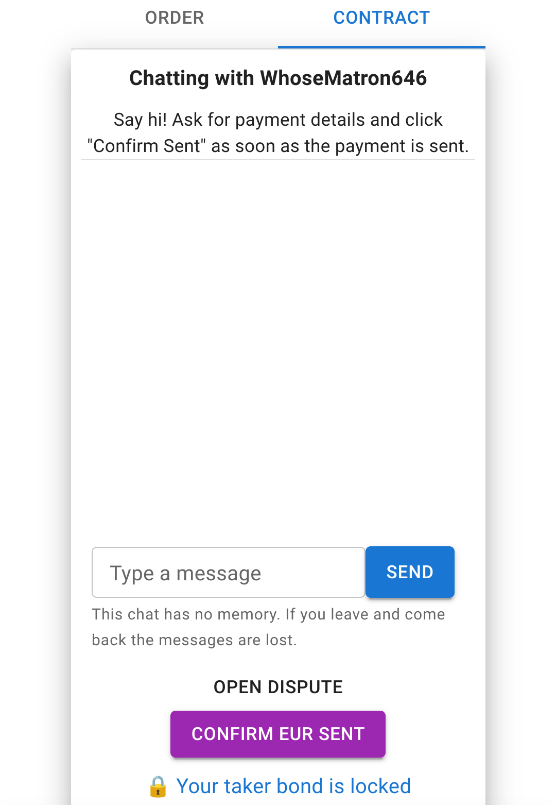

Non appena il venditore blocca i satoshi, è sicuro inviare la valuta fiat! Come acquirente, dovrai chiedere al venditore i dettagli per inviare la fiat. Condividi solo le informazioni strettamente necessarie su di te per non compromettere la tua privacy. Ricorda, in RoboSats v0.1.0 questa chat è senza memoria, quindi la conversazione andrà persa se aggiorni il browser.

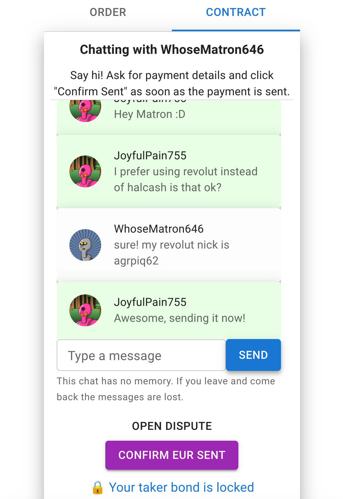

C'è un limite di tempo di 24 ore per completare lo scambio fiat. Se il tempo scade, l'ordine scadrà e verrà aperta automaticamente una controversia. Per evitare la scadenza dell'ordine, usa sempre metodi di pagamento fiat istantanei. Ad esempio, inviare contanti per posta ordinaria è lento e attiverà sempre una controversia in v0.1.0. In futuro saranno possibili tempi di scadenza più lunghi.

Non appena hai inviato la fiat, dovresti premere il pulsante "Conferma fiat inviata". Dopo di ciò, il venditore dovrà confermare di aver ricevuto la fiat. Non appena conferma, lo scambio è terminato e verrai pagato sul tuo portafoglio Lightning. Potresti vedere che sta "inviando satoshi all'acquirente", ma di solito è così veloce che vedrai semplicemente questa schermata. Goditi i tuoi sat!

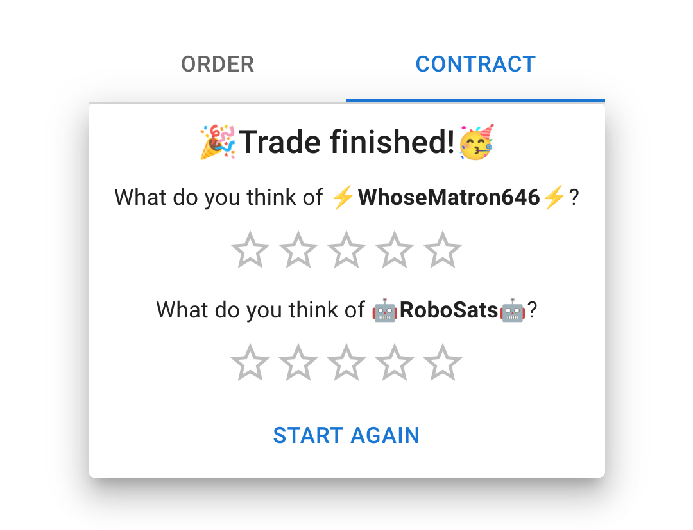

Valutare la piattaforma e lasciare suggerimenti per miglioramenti nel nostro gruppo Telegram o su Github Issues è super apprezzato!

## Guida 2: Creare un Ordine come Venditore {#guida-2-creare-un-ordine-come-venditore style="color: greenyellow;"}

Potrebbe capitare che non ci siano ordini attivi per la posizione e la valuta che desideri. In questo caso, non ci sono ordini per VENDERE Bitcoin per GBP.

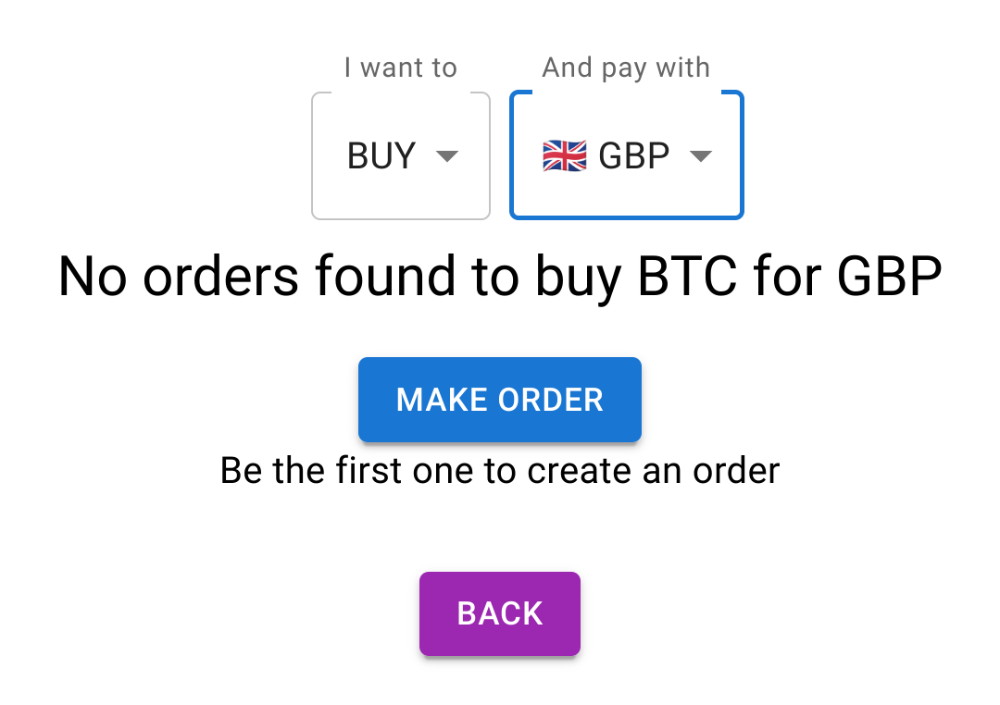

Possiamo creare l'ordine esattamente come lo vogliamo. Ma ricorda che devi pubblicare un ordine che altri vogliano accettare!

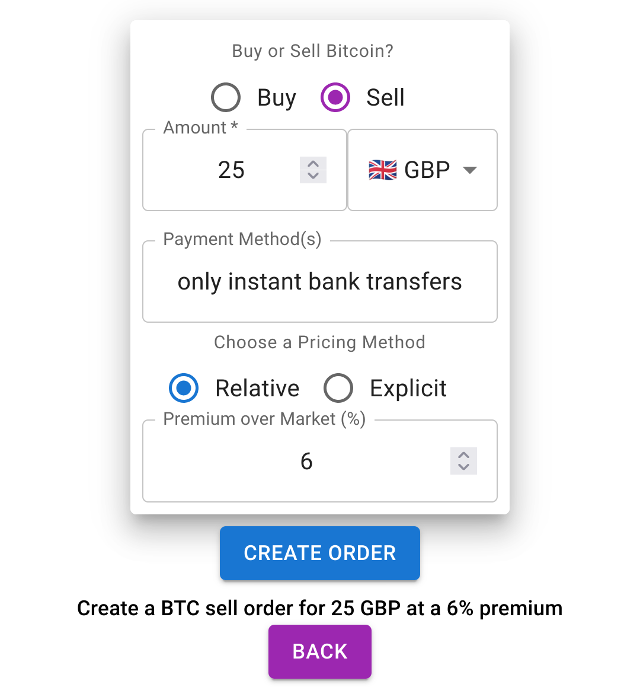

Nella pagina del creatore di ordini è richiesto solo di inserire la valuta, il tipo di ordine (acquisto/vendita) e l'importo. Tuttavia, è buona pratica specificare i metodi di pagamento che accetti. Potrebbe essere anche utile impostare un premio/sconto per far accettare il tuo ordine più velocemente. Ricorda che come venditore puoi incentivare gli acquirenti ad accettare il tuo ordine abbassando il premio. Se ci sono troppi acquirenti, tuttavia, puoi aumentare il premio per ottenere un profitto di trading. In alternativa, puoi impostare un importo fisso di satoshi.

**Limiti**: in RoboSats v0.1.0 un ordine non può essere inferiore a 20.000 satoshi. Non può essere superiore a 4.000.000 di satoshi per evitare fallimenti di routing Lightning. Questo limite sarà aumentato in futuro.

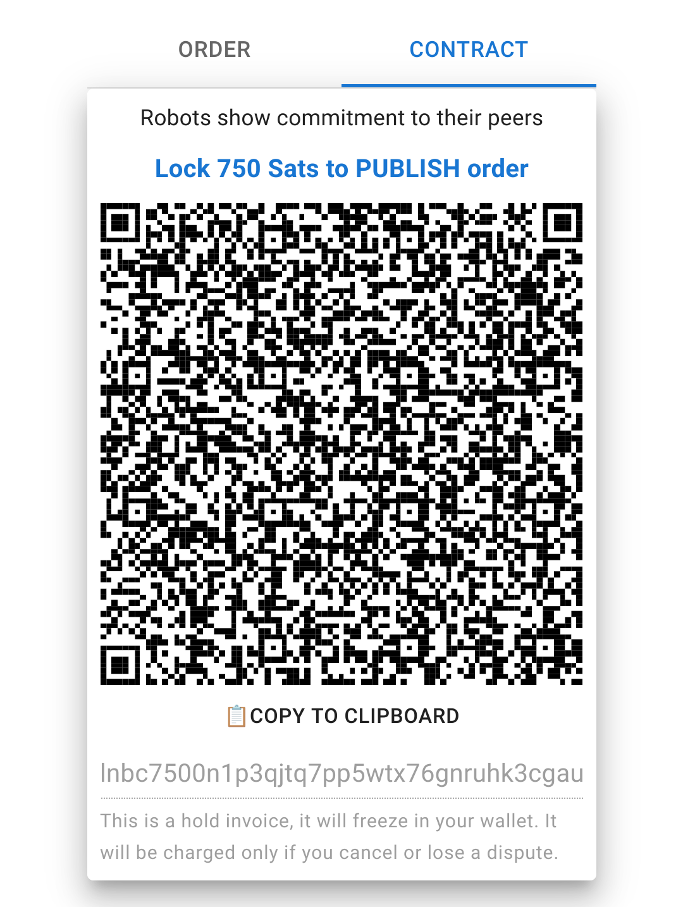

Devi copiare o scansionare la fattura con il tuo portafoglio Lightning per bloccare la tua cauzione di fedeltà come creatore (solo l'1% dell'importo dello scambio). Bloccando questa cauzione, i prenditori sanno che puoi essere affidabile e sei impegnato a seguire questo scambio. Nel tuo portafoglio potrebbe apparire come un pagamento in transito, bloccarsi o persino sembrare che il tuo portafoglio si sia rotto. Dovresti sempre controllare sul sito di RoboSats se la cauzione è stata bloccata (il tuo portafoglio probabilmente non te lo dirà! Controlla la lista di compatibilità dei portafogli).

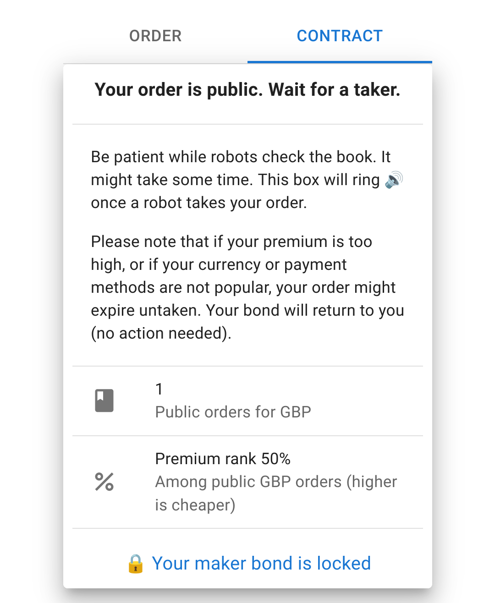

Il tuo ordine sarà pubblico per 24 ore. Puoi controllare il tempo rimasto alla scadenza controllando la scheda "Ordine". Può essere cancellato in qualsiasi momento senza penalità prima che venga accettato da un altro robot. Tieni aperta la scheda del contratto per essere notificato con questo suono. Potrebbe essere meglio farlo su un computer desktop e alzare il volume, così non ti perderai quando il tuo ordine viene accettato. Potrebbe volerci tempo! Forse te ne dimentichi anche! Puoi anche abilitare le notifiche Telegram premendo "Abilita Notifiche Telegram" e poi premendo "Start" nella chat. Riceverai un messaggio di benvenuto come conferma delle notifiche abilitate. Un altro messaggio verrà inviato una volta che un prenditore per il tuo ordine viene trovato.

**Nota**: se dimentichi il tuo ordine e un robot lo accetta e blocca la sua cauzione di fedeltà, rischi di perdere la tua cauzione di fedeltà non adempiendo ai passaggi contrattuali successivi.

Nella scheda del contratto puoi anche vedere quanti altri ordini sono pubblici per la stessa valuta. Puoi anche vedere come si posiziona il tuo premio rispetto a tutti gli altri ordini per la stessa valuta.

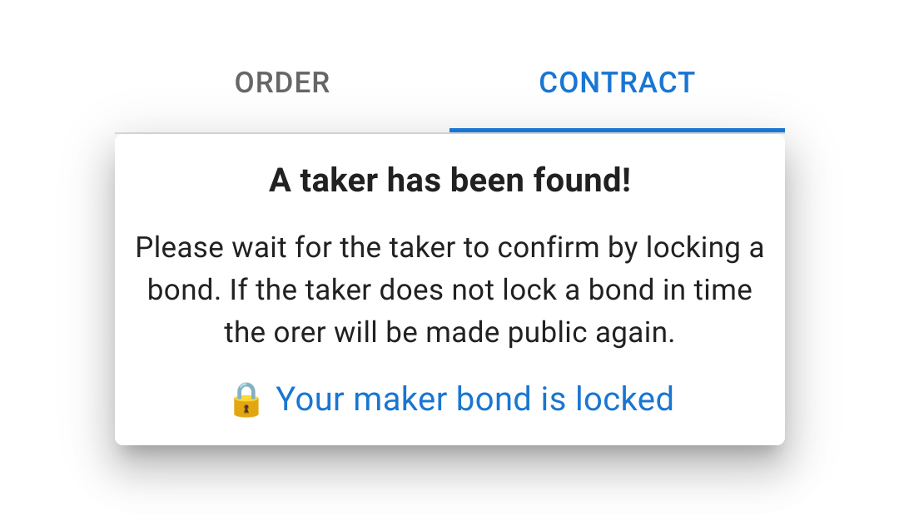

Evviva, qualcuno ha accettato l'ordine! Hanno 4 minuti per bloccare una cauzione di fedeltà come prenditore, se non procedono, il tuo ordine sarà reso pubblico di nuovo automaticamente.

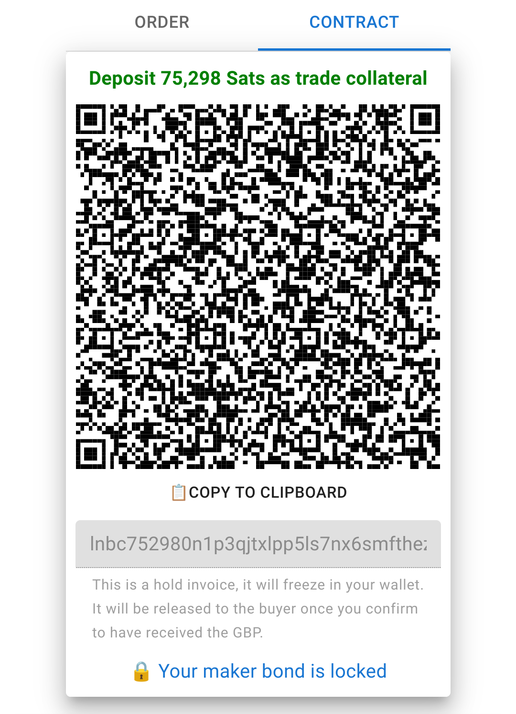

Non appena il prenditore blocca la cauzione, dovrai bloccare la cauzione del trade. Questa è una hold invoice Lightning e rimarrà bloccata nel tuo portafoglio. Sarà rilasciata solo quando confermi di aver ricevuto il pagamento fiat o se c'è una controversia tra te e il prenditore.

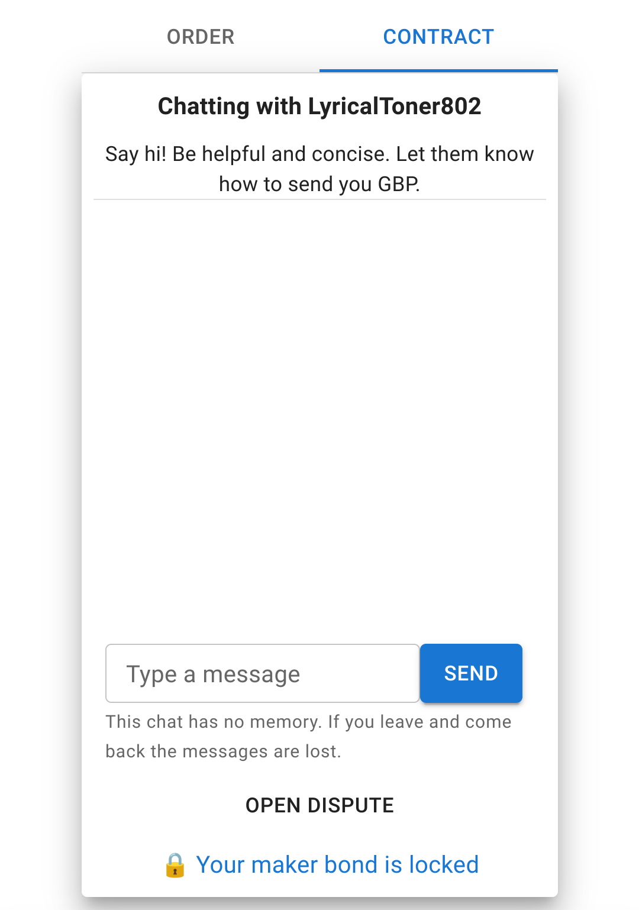

Una volta che blocchi la cauzione del trade e l'acquirente invia la fattura di pagamento, è sicuro inviare la fiat! Condividi con l'acquirente le informazioni minime necessarie per inviarti la fiat. Ricorda, in RoboSats v0.1.0 questa chat è senza memoria, quindi la conversazione andrà persa se aggiorni il browser.

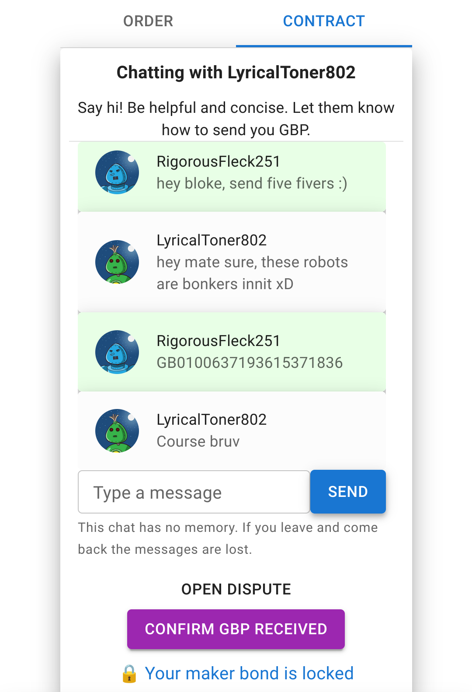

L'acquirente ha appena confermato di aver fatto la sua parte! Ora controlla finché la fiat non è nel tuo conto.

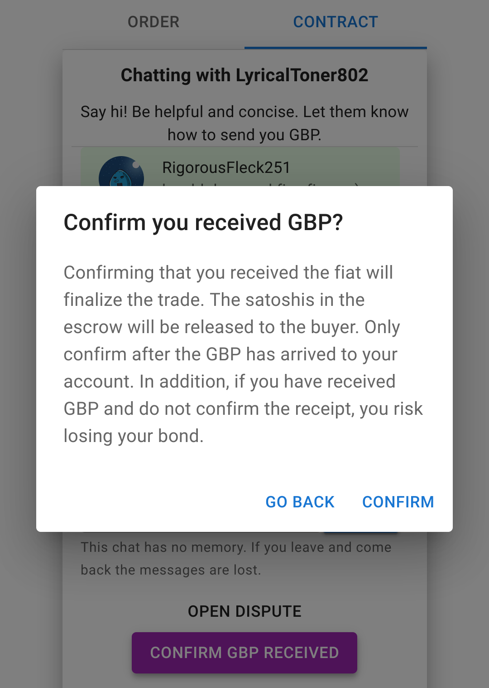

Confermando di aver ricevuto la fiat, la cauzione verrà addebitata e inviata all'acquirente. Quindi fallo solo quando sei sicuro al 100% che la fiat sia con te!

Tutto fatto!! :D

## Annullamento Collaborativo {#annullamento-collaborativo style="color: greenyellow;"}

Dopo che la cauzione del trade è stata bloccata e prima che l'acquirente confermi di aver inviato la fiat, è possibile annullare l'ordine. Potrebbe semplicemente accadere che entrambi non abbiate un modo comune per inviare e ricevere fiat dopotutto. Potete concordare di premere il pulsante "Annullamento Collaborativo". Dopo che il pulsante "Fiat inviata" è stato premuto dall'acquirente, l'unico modo per annullare un ordine è aprire una controversia e coinvolgere lo staff.

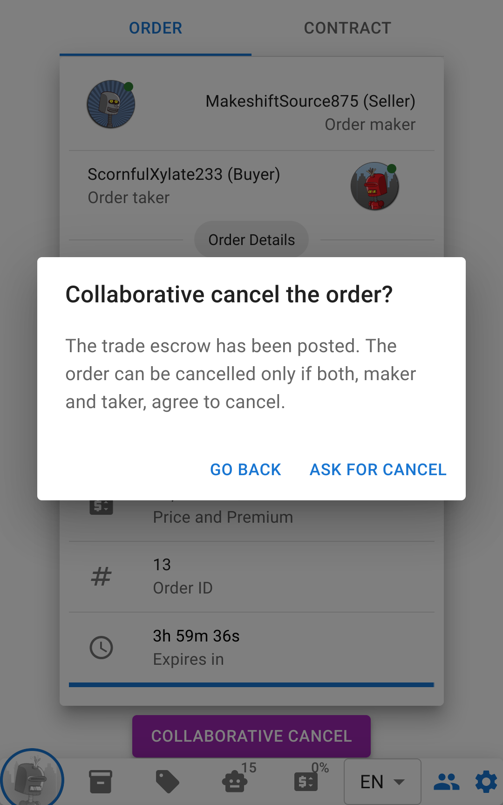

Questo non è assolutamente consigliato, uno dei due trader perderebbe la sua cauzione di fedeltà eccetto in casi eccezionali (a discrezione dello staff).

## Controversie {#controversie style="color: greenyellow;"}

Gli equivoci accadono. Ma ci possono essere anche persone disposte a cercare di truffare gli altri. In questo caso MakeshiftSource875 pensava di farla franca non confermando di aver ricevuto la fiat, come se potesse tenere i satoshi.

Questo in realtà non è possibile, poiché una controversia verrà aperta automaticamente alla scadenza. Tuttavia, se sai che qualcosa di sospetto sta accadendo, dovresti aprire una controversia.

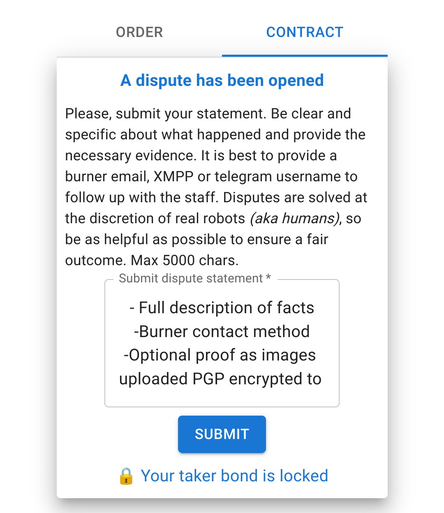

In RoboSats v0.1.0 il processo di controversia non è completamente implementato nel web. Pertanto, la maggior parte dei contatti e delle risoluzioni deve avvenire tramite metodi alternativi. Assicurati di inviare un metodo di contatto allo staff. Dovrai scrivere una dichiarazione completa dei fatti, ricorda che lo staff non può leggere la tua chat privata per giudicare cosa è successo. È utile inviare immagini/screenshot. Per la massima privacy, questi possono essere crittografati tramite chiave PGP e caricati su qualsiasi sistema di condivisione file anonimo.

Una volta che lo staff ha risolto la controversia, lo stato finale dell'ordine mostrerà la risoluzione. Assicurati di controllare il metodo di contatto fornito allo staff. Se sei il vincitore della controversia, lo staff ti chiederà nuovamente una fattura Lightning Network per inviarti il pagamento + cauzione (la tua vecchia fattura è probabilmente scaduta!).

## Conclusioni {#conclusioni style="color: greenyellow;"}

Congratulazioni! Ora sai come utilizzare RoboSats per acquistare e vendere Bitcoin in modo anonimo e sicuro. Ricorda sempre di mantenere le tue chiavi private al sicuro e di seguire le buone pratiche per proteggere la tua privacy.

Se questa guida ti è piaciuta, condividila con i tuoi amici e sui social network. Se hai suggerimenti o domande, non esitare a contattarci!

---
