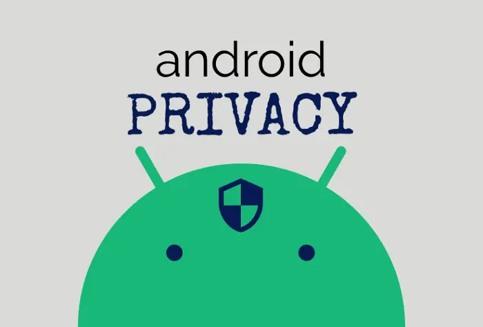

            
---
title: "Guida al De-Google e privacy su android"
description: "Guida e tutorial su come usare joinmarket per fare coinjoin su bitcoin in lingua italiana"
keywords: ["android privacy", "privacy ita", "android privacy italiano", "degoogle", "privacy phone", "graphene os", "graphene os italiano", "graphene os ita", "degoogle italiano"]
author: "Turtlecute"
date: 2024-05-15
url: /android
images: ["img/1.webp"]
---

# Android
Guida al De-Google e privacy su android.

Questa vuole essere una guida completa per ottenere un telefono Android completamente de-googled con la massima privacy e sicurezza possibile, pur mantenendo l'usabilità e comodità del dispositivo.

La guida è aperta a miglioramenti e consigli, descriverò la configurazione che trovo con il miglior rapporto usabilità/privacy, nel tempo ampierò le varie sezioni introducendo anche varie alternative per chi magari non si trova bene con una determinata applicazione o servizio, Se volete darmi consigli, contribuire alla guida o effettuare traduzioni, potete trovare i miei contatti nella pagina [Donazioni](supporto.html) o effettuare una pull request su [GitHub](https://github.com/Turtlecute33/privacy.github.io).  
  

## Sistema operativo

Esistono vari sistemi operativi Android privacy-oriented (GrapheneOS, CalixOS, etc). In questa guida tratteremo l’approccio usando come base LineageOS 12, ma è comunque compatibile con ogni altro sistema operativo AOSP.

Questa guida è stata pensata e studiata per offrire la massima sicurezza e privacy nell'utilizzo del proprio telefono, procedure come il rooting e lo sblocco del bootloader riducono notevolmente la sicurezza del dispositivo e sono per questo fortemente sconsigliate.

Per semplificare i passi per l’installazione di Lineage facciamo un brevissimo riassunto:

1.  Sbloccare il bootloader
2.  Flashare una recovery
3.  Flashare [Lineage OS](https://lineage.microg.org/) versione microG

Attenzione, la versione base senza Google apps è di gran lunga preferibile (e fortemente consigliata), ma utilizzando microG senza aggiungere nessun account Google potremo almeno utilizzare i servizi base di Android senza andare incontro a crash e malfunzionamenti di app dipendenti da essi.  
  

A questo punto ci troveremo con un sistema operativo fresco e appena installato.

## Modifica e setup del sistema

Per avere un dispositivo privacy-oriented cominceremo con il modificare i vari settings del sistema operativo, elenchiamo le principali impostazioni e accorgimenti, anche se questi possono cambiare da dispositivo a dispositivo:

*   Disabilitare bluetooth e posizione ogni volta che non li utilizziamo
*   Attivare la privacy nel blocco schermo e un metodo di protezione del dispotivo (pin e notifiche nascoste con telefono bloccato)
*   Disabilitare tutti i dati telemetrici
*   Abilitare se disattivata la criptazione del dispositivo
*   Disabilitare i backup
*   Rifiutare ogni volta, se possibile, la condivisione di dati di telemetria e crash in tutte le app installate
*   Ricordarci di disattivare il debug USB ogni volta che lo utilizziamo (disabilitato di default), in quanto espone a grossi rischi di sicurezza

Gestiremo in seguito i permessi delle applicazioni.

  
  

## Store per il download delle app

Essendo ora separati dal mondo Google dovremo trovare altri store da cui scaricare le applicazioni, le alternative principali sono:

*   [F-Droid](https://www.f-droid.org/): store alternativo di app FOSS/open source.  
    Possibilmente installeremo da qua le applicazioni, ma non aspettatevi di trovare Instagram o Facebook, contiene solo app open source, quindi al massimo troverete delle loro alternative FOSS.
*   [Droid-ify](https://www.f-droid.org/packages/com.looker.droidify/): fork di F-Droid com una grafica più curata e alcune funzioni aggiuntive, a mio parere la migliore alternativa se cercate una UI un po' più elegante.
*   [Aurora Store](https://files.auroraoss.com/AuroraStore/Stable/): vi permette di usare il vecchio store Google ma attraverso account fittizi e automaticamente generati all'avvio dell'app, mi raccomando usate la modalità ospite/anonima o sarà inutile.

  

## Shelter

Ora che abbiamo gli store configurati possiamo procedere al download di [Shelter](https://f-droid.org/packages/net.typeblog.shelter/). Se avevate già aperto F-Droid/Droid-ify in precedenza dovrebbe aprirvi il link direttamente in app.  
Shelter è un'applicazione open source che ci permette di creare un work profile, ovvero un secondo profilo nel telefono che funziona contemporaneamente al primo ma in modo totalmente isolato e indipendente  
  
Immaginate un tavolo (il nosto sistema operativo) su cui poggiano due scatole completamente chiuse e sigillate (i nostri due profili), queste due sono completamente indipendenti e separate, ma usano una base comune. Se l'OS del nostro telefono è il primo ad essere sporco e pieno di app traccianti come i Google Play Services, l'utilizzo di Shelter diventa in buona parte inutile. Nel caso in cui non vogliate cambiare ROM, usate almeno questo [Android Debloater](https://github.com/0x192/universal-android-debloater) che vi permette di disabilitare in pochi e semplici tap le principali app tossiche per la privacy incluse nei maggiori sistemi operativi di default (ATTENZIONE disabilitate le app, non disinstallatele, o rischierete di corrompere il sistema se avete il telefono criptato).  
  
Una volta aperto Shelter si aprirà un menu di configurazione del profilo di lavoro, una volta attivato accederemo all'interfaccia dell'app, che è divisa in 2 sezioni:  

*   **Main**: il profilo principale in cui installeremo solo app open source o senza accesso ad internet.
*   **Shelter**: la sezione in cui isoleremo tutte le applicazioni malevole e traccianti come social, app bancarie o closed source.

I 2 profili sono perfettamente separati e vedremo le app installate in quello principale come normali icone; quelle installate nel profilo di lavoro invece presenteranno un piccolo badge che le distingue dalle altre, esse coesisteranno all'interno dello stesso launcher. Per installare le app nel profilo desiderato ci basterà usare uno di questi 3 metodi:  
  

*   Dall'app Shelter clonare un'app da un profilo ad un altro (o dai settings usare la funzione installa APK).
*   Scaricare le app da uno store installato in quel profilo (installate Droid-ify sul profilo principale e pulito mentre Aurora in quello sporco e con le app traccianti).
*   Installare APK scaricati da internet (se possibile scaricate tutto da Droid-ify in quanto è MOLTO piu sicuro).

I due sistemi saranno perfettamente isolati, cosa abbastanza scomoda per la gestione dei contatti, galleria, file, ecc.. in quanto ognuno avrà i suoi. Nelle impostazioni di Shelter è possibile attivare una funzione che permette solo all'utente di far parzialmente parlare i due sistemi per la condivisione dei file. Nonostante questo la gestione del tutto rimarrà un po' scomoda fino a quando non ci farete l'abitudine.

  

## Gestione del threat model tra i profili

Ora che abbiamo due sistemi completamente diversi e isolati, applicheremo un threat model differente in entrambi. Nel primo (pulito ed open source) punteremo alla massima privacy facendo passare tutto il traffico dati attraverso Tor e DNScrypt, nel secondo (sporco e con elementi traccianti) invece punteremo a ridurre il più possibile il leak dei nostri dati, coscienti di utilizzare comunque applicazioni che probabilmente hanno già i nostri dati personali (andremo quindi a limitare il più possibile pubblicità e trackers).  
  
Come prima cosa ci concentriamo sul main profile ed scarichiamo [Invizible Pro](https://www.f-droid.org/packages/pan.alexander.tordnscrypt.stable/), applicazione che reindirizza tutto il traffico sotto Tor e con anche ulteriori protezioni.  
Una volta aperta l'applicazione dal menù in alto a destra con i 3 puntini attiviamo la modalità VPN. Rechiamoci quindi nelle impostazioni del telefono nella sezione **Rete → Avanzate/VPN → Invizible Pro**, qui attiviamo la modalità 'VPN sempre attiva' e 'blocca connessioni senza VPN', in questo modo tutto il traffico passerà attraverso Invizible ed eviteremo qualsiasi leak di dati.  
  
Ora che abbiamo impostato correttamente la rete andiamo a modificare alcune impostazioni all'interno di Invizible:

*   In **DNSCrypt settings** nella terza sezione abilitiamo require\_dnssec, nolog and nofilter, questo ci permetterà di usare sempre i migliori server DNS possibili.
*   Nella sezione **Fast Settings** abilitiamo 'avvia DNSCrypt all'avvio' e 'avvia TOR all'avvio', in questo modo saremo sempre protetti al 100%.
*   Sempre in **Fast Settings**, in fondo, abilitiamo l'update automatico attraverso TOR (facoltativo).
*   Nelle impostazioni rechiamoci in **Common Settings** e abilitiamo tutte e 3 le protezioni della sezione **MITM attack detection**, queste proteggeranno il nostro dispositivo quando connessi a Wi-FI pubblici.
*   Infine rechiamoci nella categoria **Firewall** e disabilitiamo l'accesso ad internet a tutte le applicazioni che non ne hanno bisogno (come per esempio la galleria, la tastiera, i giochi offline, ecc)

A questo punto il main profile è pronto per essere usato, ci possiamo ora dedicare al profilo di lavoro, quello con le applicazioni closed source.  
Qui possiamo adottare due diverse tecniche per la protezione dei dati:

*   Usare una VPN in caso cerchiamo protezione verso il nostro ISP (tramite essa possiamo anche filtrare pubblicità e tracker).
*   Usare NetGuard per bloccare l'acceso ad internet alle applicazioni che non lo necessitano ed aggiungere il blocco delle pubblicità e tracker tramite l'implementazione di un Host filter.

Entrambe le opzioni sono valide, la decisione dipende principalmente dalla vostra volontà o meno di usare un servizio VPN. In caso vogliate approfondire l'argomento potete dare un occhio anticipatamente alla [sezione apposita.](#cloud)  
Se invece preferite usare NetGuard consiglio di implementare gli Host file di [Energized Protection](https://github.com/EnergizedProtection/block).

## Applicazioni

Ora che abbiamo gli store e le reti ben configurate passiamo a scaricare alcune app fortemente consigliate:

*   [OpenBoard](https://www.f-droid.org/packages/org.dslul.openboard.inputmethod.latin/): tastiera Android open source esattamente uguale alla Gboard (faccio un piccolo discorso su questa app, so che molti sono abituati a Gboard o SwiftKey ma per l’amor del cielo evitatele, ho provato a bloccare vari processi e l’accesso ad internet alla tastiera, ma analizzando i dati scambiati con la mia rete ho notato che riusciva comunque a comunicare con i server Google. Per favore usate OpenBoard o altre tastiere open source offline).
*   [Bromite](https://www.bromite.org/): a mio parere il miglior broswer Android, purtroppo Firefox e tutti i suoi fork non supportano su Android l'isolamento delle pagine, questo crea un enorme problema di sicurezza, Bromite invece è basato su Chromium e anche se non supporta le estensioni, ha già internamente abilitato un ad block che supporta liste personalizzate e possiede anche vari tweak anti-fingerprinting.
*   [Omega launcher](https://android.izzysoft.de/repo/apk/com.saggitt.omega): ottimo launcher open source, fork di quello AOSP ma con piu' personalizzazioni, si integra perfettamente anche con Shelter creando 2 menu' delle applicazioni.
  

A questo punto possiamo procedere al download delle applicazioni facendo attenzione al profilo nel quale le installiamo, personalmente uso F-Droid sul sistema pulito e Aurora in quello con le app traccianti, vi lascio una piccola lista di app open source e privacy-oriented che potrebbero tornarvi utili:

  
*   [Aegis](https://www.f-droid.org/packages/com.beemdevelopment.aegis/): alternativa open source ed offline a Authy/Google Authenticator
*   [AntennaPod](https://f-droid.org/packages/de.danoeh.antennapod/): lettore di podcast totalmente open source, usa come fonte i principali lettori podcast esistenti
*   [Bitwarden](https://github.com/bitwarden/mobile/releases): miglior password manager, estremamente sicuro, consente anche il self-hosting
*   [Crypto Prices](https://f-droid.org/packages/de.cloneapps.crypto_prices): alternativa a CoinMarketCap
*   [Frost](https://www.f-droid.org/packages/com.pitchedapps.frost/): per quanto disprezzi e sconsigli l’utilizzo di Facebook, se proprio non riuscite a farne a meno consiglio di utilizzare Frost, un client open source per Facebook
*   [Guerrilla Mail](https://f-droid.org/it/packages/cf.theonewiththebraid.guerrilla_mail/): client per Guerrilla Mail, una temp mail per gli spam
*   [Infinity](https://www.f-droid.org/packages/ml.docilealligator.infinityforreddit/): client di ottima qualità di Reddit, a mio parere meglio dell'app originale!
*   [LibreTorrent](https://www.f-droid.org/packages/org.proninyaroslav.libretorrent/): semplice, comodo e veloce client Torrent per Android
*   [LessPass](https://f-droid.org/packages/com.lesspass.android/): permette di generare password derivate dalla combinazione di sito + nome utente + una password fissa, l'eccellenza per avere password sicure
*   [Molly](https://molly.im/): una versione hardened e ripulita dal codice Google di Signal, portebbe essere una buona idea registrarsi con una SIM comprata senza documenti se legale nel vostro stato
*   [Nekogram](https://nekogram.app/): client per Telegram che non si appoggia ai servizi Google ed implementa PGP
*   [NewPipe](https://www.f-droid.org/packages/org.schabi.newpipe/): client di PeerTube, tutti i video di YouTube ma senza Google!
*   [Nextcloud](https://f-droid.org/en/packages/com.nextcloud.client/): client per usare e syncare nextcloud, a mio parere il miglior software per farsi un server multimediale in casa
*   [OpenKeychain](https://www.f-droid.org/packages/org.sufficientlysecure.keychain/): app per gestire le nostre chiavi PGP o per integrarle nelle applicazioni di messaggistica/e-mail
*   [Simple Bitcoin Wallet](https://www.f-droid.org/packages/com.btcontract.wallet/): wallet open source leggero, veloce e dalla ottima UI per gestire i vostri Bitcoin
*   [SimpleLogin](https://www.f-droid.org/packages/io.simplelogin.android.fdroid/): una sorta di proxy e-mail anti-spam, crea delle e-mail esca con cui registrarvi ai siti che automaticamente girano le e-mail ad altri indirizzi da voi scelti, in questo modo non dovrete dare la vostra e-mail a siti esterni. Inoltre potete eliminare o sospendere le e-mail esca quando volete in modo da interrompere la ricezione delle e-mail sul vostro account principale)
*   [Simple Crypto Widget](https://f-droid.org/packages/com.brentpanther.bitcoinwidget/): per avere i prezzi aggiornati della vosta criptoval...COFF COFF di Bitcoin sulla vostra home page
*   [Simple File Manager](https://www.f-droid.org/packages/com.simplemobiletools.filemanager.pro/): file manager dall’ottima grafica e con permessi root opzionali
*   [Tor Browser](https://www.torproject.org/download/#downloads-alpha): broswer Tor ufficiale con libreria Tor integrata, utile per navigare online senza rivelare l’indirizzo IP, non garantisce un anonimato al 100% come ogni cosa ma è un ottimo scudo per la privacy, utile per navigare nei siti .onion
*   [Treecord](https://github.com/Treecord/Treecord): versione con tracker bloccati del client Discord per Android
*   [Voice](https://www.f-droid.org/packages/de.ph1b.audiobook/): lettore offline e opensource di audiolibri

Per ulteriori applicazioni, browser e servizi privacy friendly consiglio di dare un occhio a [privacytools](https://www.privacytools.io/), [privacyguides](https://privacyguides.org/providers/) o cercare nelle varie categorie su Droid-ify.

## Client e provider email

Il discorso su quale sia il miglior client e provider email è lungo e complesso, la migliore opzione sarebbe hostarsi da soli un'email, ma non e' sicuramente facile.  
  
In caso volessimo un servizio rapido e comodo ma in cui dobbiamo riporre fiducia consiglio [Proton Mail](https://github.com/ProtonMail/proton-mail-android/releases), da usare solo tramite Tor, oppure [Tutanota](https://www.f-droid.org/packages/de.tutao.tutanota/), che sembra essere un'azienda più trasparente, ma dichiara di loggare gli indirizi IP degli utenti; personalmente eviterei l'uso di entrambi questi provider in quanto promettono anonimato ma gia' in passato non hanno rispettato questa clausola e potrebbero essere degli honeypot([?](https://it.wikipedia.org/wiki/Honeypot)). Entrambe però auto-criptano i messaggi verso le email dello stesso provider (Tutanota con Tutanota e Proton con Proton).  
  
Un'opzione molto valida è quella di usare come client (quindi come app su cui riceviamo le mail) [K-9 Mail](https://f-droid.org/en/packages/com.fsck.k9/) e come provider (quindi come servizio email da collegare a K-9) o un servizio a pagamento come [FairEmail](https://email.faircode.eu/) o provare a contattare/farci invitare da qualche gruppo/collettivo privacy friendly o anarchico come [Riseup](https://riseup.net/), [Esiliati](https://esiliati.org/) o [Autistici](https://www.autistici.org/), quest'ultimo però in passato ha subito vari hack, quindi consiglio altre alternative.  
  
Molto interessante all'interno delle impostazioni di K-9 è l'opzione di auto-criptazione delle email: importando una chiave PGP da OpenKeychain (app sopra trattata), è possibile criptare automaticamente le email verso le persone che a loro volta hanno importato una chiave PGP. Dopo una prima email non criptata, K-9 importa la public key dell'altra persona permettendoci così di scambiare email criptate senza doversi passare le chiavi (da abilitare nei settings di K-9).

A questo punto della guida dovreste aver già installato tutte le vostre applicazioni personali e quelle da me indicate o consigliate, possiamo agire ora sui vari permessi. In caso installiate in futuro altre app, eseguite questa procedura anche per esse.

## Gestione dei permessi delle app

Come primo passo ci rechiamo nelle impostazioni del nostro telefono e andiamo nella sezione Applicazioni → Avanzate → Gestione permessi e qui rimuoviamo ogni permesso superfluo delle applicazioni (ad esempio un'app come WhatsApp ha bisogno dei nostri contatti se vogliamo trovarli, quindi per il corretto funzionamento della stessa conviene lasciarglielo, ma possiamo tranquillamente disabilitare l’accesso ai messaggi in quanto verrà usato solo la prima volta quando faremo il login per velocizzare il primo accesso, dopodiché se lasciato attivo concede a WhatsApp la possibilità di spiare tutti i nostri SMS).  
  
Prestiamo particolare attenzione ai permessi di geolocalizzazione, fotocamera e microfono.  
  
Quando un'app ci chiede un permesso che non è utile o siete consapevoli di usare saltuariamente, concedete il permesso ‘solo per questa volta', in modo che non ne abbia continuo accesso.  
  
Dopo aver modificato tutti i permessi andiamo anche a disabilitare l’accesso ad internet a tutte le applicazioni che non necessitano della rete (per esempio i vari file manager, calcolatrici, agende, note, tastiere, ecc). Possiamo farlo comodamente andando nelle informazioni di un'applicazione → Dati e rete → disabilitiamo ‘Accesso alla rete’.  
  
In caso vogliate essere ulteriormente certi del blocco di internet a queste app, potete usare servizi come i precedentemente trattati NetGuard e Invizible per bloccarle dietro un firewall. Non sottovalutate l’accesso ad internet delle app, molte, nonostante non ne abbiano bisogno per il loro funzionamento, lo usano di continuo per condividere nostri dati.

## Cloud e Vpn

Faccio una piccola sezione a parte per questi due sotto-argomenti: La migliore soluzione cloud sarebbe il self hosting con Nextcloud (a mio parere la miglior scelta). In caso ciò non sia possibile, la soluzione a mio parere piu semplice e veloce è [Mega.nz](http://mega.nz/) (20 GB gratis e 5 GB di bandwith ed accetta pagamento in bitcoin per i pro plans). Se vogliamo invece una sicurezza aggiuntiva possiamo usare un cloud con il supporto a WebDav come Icedrive in combinazione con [Cryptomator](https://cryptomator.org/) (programma che cripta i file prima dell’upload in cloud).  
  
Il discorso VPN invece è particolare, una VPN teoricamente cripta il nostro traffico e lo fa passare attraverso un suo nodo mettendosi tra noi e il nostro ISP dandoci maggiore privacy verso di esso ma obbligandoci a fidarci del servizio VPN stesso.  
Tutte le aziende in questo settore promettono privacy e politiche di no-logging, ma praticamente il 99% delle VPN più che darci privacy ce la fanno perdere. L’unica che mi sento davvero di consigliarvi è [Mullvad](https://mullvad.net/en/) ([onion link](http://o54hon2e2vj6c7m3aqqu6uyece65by3vgoxxhlqlsvkmacw6a7m7kiad.onion/en/)), è ovviamente obbligatorio pagarla in bitcoin per avere maggiore privacy.

## Conclusioni Finali

Seguendo questa guida avremo ridotto drasticamente la condivisione di dati personali, tuttavia ciò non garantisce in nessun modo l’anonimato ma aumenta decisamente la privacy e la sicurezza nell’utilizzo del dispositivo.  
  
L’utilizzo di MicroG lascia comunque che una piccola quantità di dati venga inviata a dei server Google, ma se seguite correttamente ciò che ho scritto sopra i dati inviati saranno davvero pochi e non più riconducibili direttamente alla vostra identità.  
Se voleste verificare quali app comunicano con internet e/o condividono vostri dati, potete utilizzare applicazioni come [PCAPdroid](https://github.com/emanuele-f/PCAPdroid) per analizzare il traffico dati creando una VPN fittizia con cui filtrate il flusso di dati proveniente dal vostro cellulare. Un'altra opzione è usare Wireshark sul vostro pc mentre siete connessi con il cellulare al Wi-Fi.  
  
Altri ottimi posti per rimanere aggiornati in ambito privacy e degoogle sono vari subreddit:

*   [DEGOOGLE](https://www.reddit.com/r/degoogle/)
*   [PRIVACYTOOLS](https://www.reddit.com/r/privacytools/)
*   [PRIVACY](https://www.reddit.com/r/privacy/)

  

> "Dire che la privacy e' inutile perché non si ha nulla da nascondere è come dire che la libertà di parola è inutile perché non si ha nulla da dire".

<form method="POST" action="https://btcpay.priorato.org/api/v1/invoices" class="btcpay-form btcpay-form--block">
  <input type="hidden" name="storeId" value="2B1STLH5REvhHZBRQuyJNieRTexpeuJ4Usjn4ziEfEfd" />
  <input type="hidden" name="checkoutDesc" value="Grazie per la donazione tartaruga!" />
  <input type="hidden" name="browserRedirect" value="https://turtlecute.org" />
  <input type="hidden" name="currency" value="EUR" />
  <input type="hidden" name="defaultPaymentMethod" value="BTC_LNURLPAY" />
  <input type="image" class="submit" name="submit" src="https://btcpay.priorato.org/img/paybutton/pay.svg" style="width:209px" alt="Pay with BTCPay Server, a Self-Hosted Bitcoin Payment Processor">
</form>