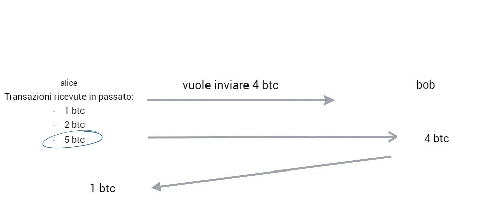

            
---
title: "Tutorial all'utilizzo di bitcoin tutelando la propria privacy"
description: "una guida dalla A alla Z su come usare bitcoin in maniera privacy oriented"
keywords: ["bitcoin privacy", "privacy ita", "bitcoin privacy italiano", "bitcoin wallet", "nodo bitcoin"]
author: "Turtlecute"
date: 2024-05-13
url: /bitcoin
---

## Bitcoin

  
Questa sarà una guida completa sull'utilizzo privacy oriented di Bitcoin partendo dalle basi fino ad arrivare a livelli avanzati.  
Partiamo quindi con una breve introduzione a Bitcoin, se siete utenti avanzati potete saltare questa prefazione andando direttamente al primo punto della guida.  

Se vi piace il mio lavoro e/o lo trovate utile vi prego di valutare una [donazione](https://priorato.btcpayserver.it/i/299LtYQKdQpsgWcSUgnWhD) per sostenere questo progetto che mi occupa, anche se con mio grande piacere, una buona fetta del mio tempo, buona lettura!

  

## Prefazione

Bitcoin non è facile da spiegare. Non esiste un paragrafo in grado di trasmettere tutte le sue proprietà cruciali. Ogni breve spiegazione è fuorviante in qualche modo.  
Questo in parte perché nulla come Bitcoin è mai esistito prima, quindi non c’è nulla con cui le persone lo paragonino. I confronti vengono effettuati automaticamente per aiutare a comprendere i concetti, ma sono imprecisi e portano a conclusioni errate.  
  
Quindi come semplificare bitcoin?  
Possiamo provare a spiegarlo identificandolo in un protocollo informatico che ognuno di noi puo' installare sul proprio computer a casa, come un qualsiasi programma, partecipando cosi alla rete che e' decentralizzata (non cé un server centrale che controlla bitcoin ma ognuno di noi partecipa attivamente alla rete come in una sorta di democrazia diretta). 

Utilizzando questo software possiamo inviare, ricevere e conservare bitcoin, che sono la moneta che si sposta su questo protocollo, ogni volta che effettuiamo una transazione ogni persona che partecipa al protocollo se la annota e la salva in un file chiamato blockchain, una sorta di 'libro mastro' uguale per ogni persona al quale tutti aggiungono le proprie transazioni quando effettuate.  
  

### Fonti e raccolte di guide per entrare nel mondo Bitcoin

Per capire meglio il funzionamento generale di Bitcoin vi consiglio un paio di fonti in cui potete ottenere tutte le informazioni per cominciare a capire meglio questa tecnologia, tanto complicata da comprendere quanto facile da utilizzare:

*   [Cose da sapere](https://bitcoin.org/it/da-sapere) (dal sito bitcoin.org possiamo guardare alcune delle caratteristiche di Bitcoin)
*   [Github di MirSerena](https://github.com/mirserena/risorsebitcoin/) (Questa ragazza ha fatto una raccolta di tutte le fonti scritte, audio e video ordinate per difficolta, dateci assolutamente un occhio!)
*   [Insieme di video su bitcoin in italiano](https://pindol.medium.com/premessa-1e5254a52475) (raccolta di tutti, o quasi, i video piu'interessanti su Bitcoin in italiano, dall'ABC fino ad argomenti piu'complessi)
  

## Fare un nodo Bitcoin

Il primo argomento di vitale importanza da affrontare e'quello dei Full node ([?](https://cryptonomist.ch/2021/07/04/cosa-sono-i-nodi-di-bitcoin/)), esistono diversi modi di implementarli piu' o meno facili ([Guida di Filippone](https://github.com/Fillippone/NodoBitcoinforDummies),[Usando RaspiBlitz](https://github.com/rootzoll/raspiblitz), tramite [Umbrel](https://getumbrel.com/#start)) o scaricando bitcoincore sul proprio pc. Quali sono i vantaggi di avere un nodo Bitcoin? in cosa e come migliora la nostra privacy?  
  
Avere un nodo Bitcoin ci permette di partecipare attivamente alla rete ma anche di non dover chiedere a nodi sconosciuti casuali nel network informazioni riguardanti il nostro wallet (senza un nodo andremmo a rivelare di quali indirizzi siamo proprietari, le quantita' di bitcoin presenti in ogni indirizzo, l'indirizzo IP e quindi anche la nostra localizzazione).  
  
Per raggiungere l'indipendenza finanziaria completa e partecipare al network e' fondamentale avere un nodo bitcoin, in caso non potessimo averne uno per varie motivazioni ci sono wallet (prossimo argomento trattato), che ci permettono per lo meno di arginare parzialmente i problemi lato privacy.

## Acquistare bitcoin

Esisistono vari modi per acquistare Bitcoin proteggendo la vostra privacy, ognuno con i propri pro e contro,  
ovviamente eviteremo exchange centralizzati e servizi KYC, lasciare i propri documenti ad enti terzi non e' mai una buona idea (vorrebbe dire esporre totalmente i nostri dati ad un ente terzo il quale potra'eventualmente vendere i nostri dati al miglior offerente o essere hackerato).  
  
ecco i quattro servizi che preferisco per l'acquisto di Bitcoin:  

*   [Bisq](https://bisq.network/) e' un software open-source che permette l'acquisto,vendita e scambio di bitcoin ed altre criptovalute in modo Peer to Peer, si connette automaticamente attraverso tor ed implementa vari sistemi di sicurezza e protezione degli acquisti.  
      
    
    **PRO**
    
    *   Totalmente decentralizzato e P2P
    *   Buona liquidita per gli scambi
    *   Molti metodi di pagamento accetatti
    *   Self-hosted in quanto crea un client locale connesso tramite tor alla rete Bitcoin
    *   Non essendo web based non avete perdita di privacy attraverso cookie o fingerprinting
    
      
    
    **CONTRO**
    
    *   Molto complicato per una persona alle prime armi
    *   Richiede di mantere una quantita di BTC su un hot wallet
    *   dovete fare un piccolo deposito da mentere come una sorta di "caparra"
    *   supporta shitcoins
  
*   [Bitcoin Market](https://t.me/bitcoinIta_Market) e'un gruppo telegram italiano in cui effettuare acquisto e vendita di Bitcoin in modo P2P, la sicurezza e'garantita da un sistema di regole, arbitri e sposorizzazioni (in caso qualcuno scammi ha 2 persone che fanno da garante e pagano al posto suo). [Regole](https://gist.github.com/lucayepa/3bec3ba83fcc9a576aa79a7f16326be3).  
      
    
    **PRO**
    
    *   Totalmente P2P
    *   Supporta solo bitcoin
    *   Di facile utilizzo una volta capite le regole
    *   Non essendo web based non avete perdita di privacy attraverso cookie o fingerprinting
    *   community molto attiva e aperta
    
      
    
    **CONTRO**
    
    *   FEE non bassissime
    *   Non molto liquido
    *   Riponete un minimo di trust alla piattaforma telegram
  
*   [Relai](https://relai.me/tartaruga) e' un servizio svizzero che permette l'acquisto e vendita di bitcoin a mercato fino a 900€ al giorno senza KYC (leggi svizzere). Se usate il codice 'tartaruga' avrete lo 0.5% di sconto sulle FEE.  
      
    
    **PRO**
    
    *   Di utilizzo super facile
    *   FEE molto basse (1%)
    *   Totalmente non custodial
    *   Permette di fare PAC
    
      
    
    **CONTRO**
    
    *   Anche se non forniamo documenti possono tracciare comunque il mittente del bonifico
    *   Piattaforma centralizzata
    
      
    
  
*   [Bitcoin voucher bot](https://t.me/BitcoinVoucherBot?start=Privacyfolder) e' un bot su telegram che permette l'acquisto tramite bonifico di voucher bitcoin onchain, Lightining network e Liquid. Il vostro pagamento andra'ad una societa Offshore che a sua volta ordinera un Voucher bitcoin che vi verra'inviato su telegram sempre attraverso il bot ma emesso da un altra societa' andando cosi ad aggiungere un layer di sicurezza aggiuntivo (non stiamo comprando direttamente bitcoin ma voucher riscuotibili da tutti i principali wallet mobile LN).  
      
    
    **PRO**
    
    *   Di utilizzo molto facile
    *   FEE accettabili (3%)
    *   Non p2p ma forse il migliore tra i metodi centralizzati
    *   Non essendo web based non avete perdita di privacy attraverso cookie o fingerprinting
    *   Bitcoin only
    *   Supporta lightning
    
      
    
    **CONTRO**
    
    *   Anche se non forniamo documenti possono tracciare comunque il mittente del bonifico( anche se con difficolta' aggiuntive rispetto a bity)
    *   Piattaforma centralizzata
    *   Riponete un minimo di trust alla piattaforma telegram
    
      
    

  
Mi sento di consigliare tutti e 4 i servizi sopra citati, sono di ottima qualita', dovete solo trovare quale di questi si adatta meglio alle vostre esigenze di privacy e facilita d'uso.

## I Wallet bitcoin

Esistono diverse categorie di wallet, li divideremo per comodità nelle principali:

*   **wallet custodial** (assolutamente da evitare, not your keys not your coin)
*   **wallet non custodial** (quelli che andremo a selezionare nella guida)

che a loro volta si dividono in:

*   **wallet desktop** (i migliori per l'HODL e la custodia dei propri bitcoin)
*   **wallet mobile** (meglio usarli come "il portafoglio con cui andate in giro e non come il conto corrente che conserva tutti i vostri risparmi")

Possiamo notare come il wallet che il piu'possibile si adatti alle nostre esigenze debba essere obbligatoriamente **non custodial** e desktop, possibilmente usato in combinazione con un hardware wallet.  
  
Il programma che meglio si adatta alle nostre esigenze privacy oriented e'sicuramente [Wasabi wallet](https://wasabiwallet.io/) ([Onion link](http://wasabiukrxmkdgve5kynjztuovbg43uxcbcxn6y2okcrsg7gb6jdmbad.onion)), scaricatelo assolutamente dal link onion (tor) per rimanere il piu possibili anonimi. Se siete utenti un pochino piú esperti e sapete collgare un wallet al vostro nodo potete usare anche molti altri wallet famosi come sparrow, electrum, ecc...  
  
Le principali features privacy di wasabi sono:  
  

*   Protezione contro il tracciamento degli indirizzi (un singolo wallet ha un numero enorme di indirizzi al suo interno, quando ci colleghiamo esso chiede al nodo a cui si connette la quantita' di bitcoin presenti su ogni indirizzo, con Wasabi non andremo a comunicare la lista degli address ma andremo a scaricare interamente i blocchi contenenti le nostre transazioni, cosi' da mitigare il tracciamento dei nostri indirizzi da parte del nodo a cui ci connettiamo).
  
*   Connessione automatica sempre e solo attraverso TOR che e' direttamente incluso all'interno del software stesso.
  
*   Indirizzi usa e getta automatici e descrizione degli indirizzi (come spiegheremo nella prossima sezione, per avere una buona privacy e' assolutamente obbligatorio usare gli indirizzi sempre e solo una volta, Wasabi wallet automaticamente quando andremo nella sezione 'Ricevi' ci mostrera' un indirizzo nuovo e mai usato con anche una piccola sezione chiamata 'Label' in cui potremo dare una sorta di etichetta all' indirizzo in mondo da ricordarci per cosa abbiamo usato o a chi abbiamo inviato quella transazione).

Parlando invece di wallet mobile esistono 2 buone alternative:  
  

*   [BlueWallet](https://bluewallet.io/)
*   [Simple Bitcoin Wallet](https://sbw.app/)

Entrambi pero' per un uso che protegga la nostra privacy necessitano di avere un full node proprio o di un conoscente in quanto in mancanza di esso il wallet si connettera' a nodi casuali, cosa che vogliamo assolutamente evitare; in caso vogliate usare uno dei due prima di creare/importare il vostro portafoglio connettetevi al vostro nodo ed abilitate TOR (su SBW attivabile dalle impostazioni e su blue abilitato automaticamente se lo si connette ad un nodo con link TOR).

## Le transazioni

Il primo consiglio che posso darvi quando effettuate transazioni e' quello di aumentare le euristiche coinvolte e fate il possibile per confondere un possibile ente che analizza la blockchain:  
non inserite output di una transazioni ovvi e con resti minuscoli (esempio: evitate di inviare una transazione da 0.1 BTC, preferite cifre meno 'umane' come per esempio 0.10127644), variate gli orari di invio delle TX e cambiate le impostazioni della transazione stessa spesso (come per esempio usate a volte la funzione [RBF](https://www.buybitcoinworldwide.com/rbf/) e a volte no), in questo modo eviterete il fingerprinting.  
  
Le transazioni bitcoin sono basate sugli **UTXO** (Unspent Transaction Output), la comprensione di quest'ultimi e' **fondamentale** per una buona privacy:  
I wallet non sono dei contenitori che hanno all' interno semplicemente i vostri bitcoin (come un normale portafoglio con le banconote), ma contengono le vostre monete divise per ogni singola transazione ricevuta (UTXO) ovvero separa metaforicamente il portafoglio in piccole tasche ed ognuna di queste contiene una transazione che avete ricevuto in passato; quando andremo ad inviare i nostri bitcoin, il wallet, o noi manualmente, potremo spendere una (o piu' in caso non bastino) vecchia transazione ricevuta ed in caso questa sia maggiore dell' importo che vogliamo inviare riceveremo un resto, spieghiamo meglio questa meccanica attraverso questa immagine:  
  

 

Alice vorrebbe inviare 4 btc a bob e possiede 3 UTXO: 1 btc, 2 btc e 5 btc; il miglior modo che ha alice per pagare bob e' usare il suo UTXO da 5 btc, che pero' eccede la quantita' che alice vorrebbe inviare, automaticamente il wallet e il protocollo Bitcoin gestiscono la cosa inviando i 5 btc a bob, ma immediatamente 1 btc torna indietro come resto, in modo che bob riceva la quantita' corretta di btc e alice ottenga indietro la parte in eccesso.  
  

Il resto di una transazione bitcoin viene accreditato su un altro indirizzo appartenente sempre al nostro wallet, infatti, per chi non lo sapesse, i Wallet bitcoin derivano da un unica chiave centinaia di migliaia di indirizzi, in questo modo ognuno di noi con un solo portafoglio puo' sempre usare per ogni transazione un indirizzo diverso, questa cosa e' **ESTREMAMENTE IMPORTANTE E FONDAMENTALE** in quanto ci fa apparire a livello di analisi on-chain come identita' separate (i vari address pur appatenendo allo stesso wallet non sono ricollegabili alla stessa identita' analizzando la blockchain).  
  
Il resto di una transazione (La parte di un UTXO che ci viene rimandata indietro nell'immagine precedente) e' una sorta di 'Scoria tossica' per la nostra privacy in quanto e' direttamente ricollegabile utilizzando l'analisi della blockchain al nostro precedente indirizzo da cui era partita la transazione e permette ad un utente malevolo esterno di analizzare lo storico delle transazioni passate e future che coinvolgeranno questo resto, collegandole ad un unica identita'.  
  
Come fare quindi per 'ripulire' questi resti? ci sono due modi principali e li analizzeremo a breve nelle sezioni successive della guida.

## Il coinjoin

In sostanza, un CoinJoin comporta la combinazione di input da diversi utenti in una singola transazione. Prima di spiegare il come (e il perché), diamo un'occhiata alla struttura di una transazione normale. Le transazioni Bitcoin sono costituite da input e output. Quando un utente vuole effettuare una transazione, prende i suoi UTXO come input, specifica gli output e firma gli input. E' importante sottolineare che ciascun input viene firmato in modo indipendente, e gli utenti possono impostare output multipli (destinati a diversi indirizzi).  
  

  
  
Se analizziamo una transazione composta da quattro input (0,2 BTC ciascuno) e due output (0,7 BTC e 0,09 BTC), possiamo fare alcune supposizioni. La prima è che stiamo guardando lo svolgimento di un pagamento – il mittente sta inviando uno degli output a qualcuno, e restituendo il resto a sé stesso. Dato che ha usato quattro input, l'output più grande è probabilmente per il ricevente. Nota che mancano 0,01 BTC negli output, corrispondenti alla commissione pagata ai miner. E' anche possibile che il mittente voglia creare una UTXO grande riunendo diverse più piccole, quindi consolida gli input più piccoli per ottenere il risultato desiderato di 0,7 BTC. Un'altra supposizione che possiamo fare si basa sul fatto che ogni input viene firmato in modo indipendente. Questa transazione potrebbe avere fino a quattro partecipanti diversi che firmano gli input, e qui troviamo il principio che rende efficaci i CoinJoin.  
  

### Come funziona il coinjoin

L'idea è che più parti si coordinano per creare una transazione, fornendo ciascuna gli input e gli output desiderati. Dato che tutti gli input vengono combinati, diventa impossibile dire con certezza quale output appartiene a quale utente. Considera il diagramma riportato sotto:  
  
  

  
  
Qui, abbiamo quattro partecipanti che vogliono spezzare il collegamento tra transazioni. Si coordinano tra loro (o tramite un coordinatore dedicato) per annunciare gli input e gli output che vogliono includere.  
  
Il coordinatore prenderà tutte le informazioni, le userà per creare una transazione, e farà firmare ogni partecipante prima di trasmetterla al network. Quando gli utenti hanno firmato, la transazione non può essere modificata senza diventare invalida. Quindi, non c'è il rischio che il coordinatore scappi con i soldi.  
  
La transazione funziona come una sorta di scatola nera per mischiare monete. Ricorda che di fatto distruggiamo UTXO per crearne di nuove. L'unico collegamento tra le vecchie e le nuove UTXO che abbiamo è la transazione stessa, ma, ovviamente, non possiamo distinguere tra i partecipanti. Nella migliore delle ipotesi, possiamo dire che un partecipante ha fornito uno degli input e potrebbe forse essere il nuovo proprietario di un risultante output. Ma anche questo non è affatto garantito. Chi può dire, analizzando la transazione descritta sopra, che ci sono quattro partecipanti? Si tratta di una persona che invia i propri fondi a quattro suoi indirizzi? Due persone che effettuano due acquisti separati e restituiscono 0,2 BTC ciascuno nei propri indirizzi? Quattro persone che inviano a nuovi partecipanti, o rinviano indietro a sé stessi? Non possiamo esserne sicuri.  
  
  

> Come appare un coinjoin visto da un block explorer (blockstream)

Possiamo sfruttare quindi il coinjoin (già integrato all'interno del wallet consigliato precedentemente) per andare a ripulire tutti i nostri resti. Purtroppo su wasabi l'importo minimo per effettuare un coinjoin è di 0.1 bitcoin, se non arriviamo a questa cifra possiamo usare [HODL HODL](https://hodlhodl.com/), aspettare il nuovo aggiornamento di wasabi wallet che permetterà coinjoin con qualsiasi cifra (in arrivo a breve) oppure provare a ri-guadagnare privacy utilizzando Lightning Network (da ora abbreviato in LN) come spiegato nella prossima sezione.  

## Lightning Network

In questo paragrafo non andremo direttamente a spiegare cosa è e come funziona LN in quanto sarebbe davvero troppo lungo e complicato, analizzeremo invece come utilizzarlo praticamente per migliorare la nostra privacy.  
  
L'ideale sarebbe avere un nodo LN, in caso questo non sia possibile potremo usare un wallet compatibile con LN, ecco una piccola selezione di quelli che ritengo migliori:

*   [Phoenix](https://phoenix.acinq.co/) probabilmente il miglior wallet pronto all'uso per quanto riguarda la privacy, il grosso 'contro' è l'alto costo che si trattiene l'azienda che lo ha creato come fee di utilizzo [fee di phoenix](https://phoenix.acinq.co/faq#what-are-the-fees)).
*   [Breez](https://breez.technology/) Sarebbe uno dei migliori, 0 fee, solo quelle di rete, ottimi servizi integrati, non supporta tor ma possiamo usarlo con orbot o vpn ma ha un grosso difetto: effettua i backup del wallet solo su google drive o su un server personale se ne possedete uno, non ci sono alternative funzionanti, a mio parere un grosso difetto.

Per guadagnare un minimo di privacy sui nostri resti accumulati nei nostri indirizzi possiamo depositarli sul nostro wallet LN con delle transazioni onchain  
  
**!ATTENZIONE!** E' fondamentale che prima di tutto usiate tor o vpn quando utilizzate il wallet LN, inoltre inviate i resti uno alla volta, in modo da non collegare tutti i vari resti alla vostra identita' (quando depositate fondi sul wallet LN con una transazione onchain il wallet utilizzera' i submarine swap e vi generera' un indirizzo diverso per ogni transazione di deposito, inviando un resto alla volta sembrerete identita' diverse sull blockchain).  
  
una volta ricevuti i vari fondi sul wallet possiamo ri-mandarli on chain tramite siti come [Boltz](https://boltz.exchange/) ([ONION LINK USATELO](http://boltzzzbnus4m7mta3cxmflnps4fp7dueu2tgurstbvrbt6xswzcocyd.onion/)) sempre in piccole transazioni diverse e sempre con importi che non sembrino umani (come spiegato prima).

## Conclusione

Riassumendo la guida possiamo ripassare i punti fondamentali:  
Se possibile facciamo girare un full node BTC e LN in casa nostra ed utilizziamo Wasabi come nostro wallet desktop, i mobile wallet se potete evitateli o per lo meno teneteli scollegati a livello di transazioni blockchain dal vostro portafoglio di HODL, usate sempre tor (wasabi lo integra automaticamente) e state attenti a come effettuate le transazioni, ogni indirizzo va usato una volta sola, effettuate transazioni diverse tra loro che non sembrino 'umane' ed inoltre fate il possibile per evitare resti, in caso non ci riusciate ripuliteli con coinjoin o LN.  
  
Spero che la guida vi sia piaciuta e che vi abbia aiutato!

<form style="width: 90%;" method="POST" action="https://priorato.btcpayserver.it/api/v1/invoices"
class="btcpay-form btcpay-form--block">
<input type="hidden" name="storeId"
value="71VPnrvEuzcPxNZEyEC7BRcQL7DZvZR8CCnCqNm8hphz" />
<input type="hidden" name="checkoutDesc" value="guida nodi tor" />
<input type="hidden" name="currency" value="EUR" />
<button type="submit" class="submit" name="submit"
style="min-width:209px;min-height:57px;border-radius:4px;border-style:none;background-color:#0f3b21;cursor:pointer;"
title="Pay with BTCPay Server, a Self-Hosted Bitcoin Payment Processor">Donazione con

</button>
</form>