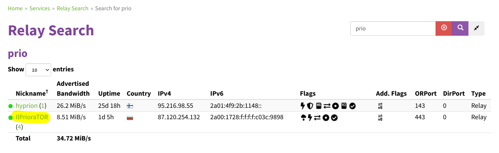

## Tor

Tutorial per il setup di un nodo Tor

Questa vuole essere una guida completa per lanciare un nodo a supporto
della rete tor. Prima di iniziare spieghiamo in breve cos\'è questo
protocollo:

La rete Tor, acronimo di \"The Onion Router\", è una rete di
comunicazione anonima progettata per aumentare la privacy e la sicurezza
degli utenti su Internet. Il suo nome deriva dal concetto di \"onion\",
poiché il suo funzionamento si basa su diverse strati di crittografia,
simili agli strati di una cipolla.

Il principale obiettivo di Tor è rendere difficile il tracciamento delle
attività online degli utenti, proteggendo la loro identità e la loro
posizione. La rete funziona instradando il traffico Internet attraverso
una serie di server volontari, noti come \"nodi Tor\", gestiti da
volontari distribuiti in tutto il mondo. Ogni nodo Tor rimuove uno
strato di crittografia, rivelando solo l\'indirizzo IP del nodo
precedente, rendendo difficile risalire all\'origine del traffico.

Grazie a questo approccio stratificato, Tor fornisce un grado
significativo di anonimato agli utenti, ma è importante notare che non
offre una sicurezza totale e può essere vulnerabile a attacchi in alcuni
scenari. Nonostante ciò, la rete Tor è ampiamente utilizzata da
giornalisti, attivisti per i diritti umani e utenti che cercano di
preservare la loro privacy online.

Per ulteriori informazioni consiglio caldamente l\'ascolto di questa
puntata:
  

<iframe style="border-radius:12px"
        src="https://open.spotify.com/embed/episode/2pc9gy07lJkhajX83ZaVDy?utm_source=generator" width="100%"
        height="352" frameBorder="0" loading="lazy"
        allow="autoplay; clipboard-write; encrypted-media; fullscreen; picture-in-picture"></iframe>

## Tabella dei contenuti {#tabella-dei-contenuti style="color: greenyellow;"}

-   [Obiettivo](#os)
-   [Valutazione dei rischi](#set)
-   [Scelta dell\'hosting provider](#store)
-   [Setup del nodo con script automatizzato](#shelter)
-   [Setup del nodo compilando tutto da sorgente](#app)
-   [Verifiche post installazione](#email)
-   [Test di funzionamento](#cloud)
-   [Conclusioni](#conc)

## Obiettivo {#os style="color: greenyellow;"}

L\'obiettivo finale di questa guida sarà quello di hostare un nodo Tor
(in locale o su una VPS) valutando i vari benefici e rischi. Alla fine
di questa guida starai ufficialmente aiutando il network dando anche tu
il tuo contributo rendendolo piu sicuro e resistente ad attacchi.\
Ci saranno 2 modi per seguire questa guida:

-   Con script automatizzato creato da me (consigliato)
-   Compilando tutto da sorgente (piú complicato)

Prima di procedere però con l\'installazione vera e propria, nella
prossima sezione analizziamo i rischi e benefici di installare un nodo
su una propria rete domestica oppure su un server a noleggio.

## Valutazione dei rischi {#set style="color: greenyellow;"}

L\'installazione di un nodo Tor, che sia su una rete domestica o su un
server a noleggio online, richiede una valutazione attenta delle
esigenze individuali. Nel contesto di una rete domestica, uno dei
principali vantaggi risiede nel completo controllo dell\'infrastruttura,
permettendo la personalizzazione delle configurazioni in base alle
proprie necessità. Inoltre, l\'esecuzione di un nodo Tor in ambito
domestico può risultare più economica, specialmente se si dispone già
dell\'hardware necessario.\
\
Tuttavia, sono presenti alcuni svantaggi da prendere in considerazione.
Le connessioni domestiche spesso presentano limiti di larghezza di
banda, influenzando la velocità complessiva del nodo Tor. Inoltre, la
connessione a Internet potrebbe non garantire sempre un livello di
affidabilità ottimale, e l\'assegnazione di indirizzi IP dinamici da
parte dei provider potrebbe rendere il nodo meno stabile nel tempo. Un
ultimo sventaggio da notare è che lanciando un nodo nella propria rete
domestica si ammette pubblicamente di avere un nodo tor in casa, cosa
che per alcuni amanti della privacy può comoportare un noioso problema
da affrontare.\
\
D\'altra parte, l\'utilizzo di un server a noleggio online offre
vantaggi come una larghezza di banda elevata, maggiore affidabilità e la
possibilità di avere un indirizzo IP statico. Tuttavia, questa opzione
comporta costi mensili più elevati e potrebbe limitare il controllo
diretto sull\'hardware rispetto a una soluzione domestica.\
\
Va inoltre considerato che la gestione remota di un server a noleggio
potrebbe richiedere la conformità alle leggi e alle politiche del paese
in cui il server è ospitato. In conclusione, la scelta tra un nodo Tor
su rete domestica e su server a noleggio online dipende da vari fattori,
tra cui il livello desiderato di controllo locale, il budget
disponibile, la larghezza di banda necessaria e la conformità alle leggi
locali.\
\
Per riassumere: un nodo casalingo fornisce una maggiore sicurezza e
decentralizzazione al network, i principali svantaggi sono che si leaka
il fatto che si sta runnando un nodo tor presso il proprio domicilio e
si potrebbe avere qualche difficoltà in più a gestrire i vari permessi
della rete locale. Quando invece si parla di server a noleggio online
(più avanti nella guida ve ne consiglierò alcuni) la configurazione sarà
piu facile e veloce a fronte però di costi piu alti e un minor controllo
diretto sull\'hardware.

## Scelta dell\'hosting provider {#store style="color: greenyellow;"}

Quando ci si appresta a noleggiare una Virtual Private Server (VPS) per
ospitare un nodo Tor, è fondamentale porre attenzione a diversi
parametri al fine di garantire un\'esperienza affidabile e sicura:\
\
In primo luogo, la larghezza di banda fornita dalla VPS gioca un ruolo
cruciale, influenzando direttamente la velocità e la stabilità del nodo.
Una larghezza di banda adeguata è essenziale per gestire in modo
efficiente il traffico sulla rete Tor.\
\
La località del server rappresenta un ulteriore aspetto da valutare
attentamente. scelta di una posizione geografica strategica può
migliorare le prestazioni complessive del nodo, riducendo la latenza per
gli utenti che si connettono attraverso di esso. Ha anche importanti
ripercussioni in quanto in base alla giurisdizione cambiano anche le
leggi informatiche a cui deve sottostare il vostro provider.\
\
La politica sulla privacy del fornitore di VPS è altrettanto critica.
Verificare che il provider rispetti la privacy degli utenti e non
registri o monitori attività sensibili è essenziale per mantenere un
nodo utile alla rete.\
Inoltre, è consigliabile optare per una VPS con un indirizzo IP statico
(quasi tutte lo forniscono), poiché ciò contribuirà a garantire la
stabilità del nodo Tor nel lungo periodo.\
\
Infine, esaminare le opzioni di sicurezza fornite dal provider, come
firewall e crittografia, rappresenta un aspetto fondamentale per
proteggere il nodo Tor da potenziali minacce esterne.\
\
Attraverso una valutazione accurata di questi parametri, è possibile
selezionare una VPS che soddisfi i requisiti necessari per ospitare in
modo affidabile e sicuro un nodo Tor.\
\
Ecco un elenco di quelle a mio parere migliori per hostare un nodo:

-   [VPSbG](https://www.vpsbg.eu/aff/1e5d9e) a mio parere il miglior
    rapporto tra potenza, banda, privacy, usabilità e metodi di
    pagamento accettati. Non il più economico ma quello che offre la
    miglior esperienza d\'uso. Server in bulgaria e accettano sia middle
    che exit node (se configurati correttamente, il mio script lo fa già
    in automatico).
-   [UDN](https://www.urdn.com.ua/index.html) ovvero Ukranian Data
    Network offre VPS in maniera davvero super privacy, e con super
    privacy intendo che l\'unico modo per comprarne una è scrivere ad
    uno degli admin su XMPP, non cè altro modo per acquistare e non cè
    nessun account da creare. VPS a buon prezzo, non molto potenti ma
    con molta banda a disposizione (10.15 TB).
-   [Trabia](https://www.trabia.com/) è un VPS provider in moldavia, ha
    ottimi prezzi, vps non molto potenti ma banda ILLIMITATA, una vera
    rarità a questi prezzi. Lato privacy bene ma non benissimo,
    accettano bitcoin ma vi chiedono di inserire un po di dati
    personali. Per esperienza personale i dati possono essere tutti
    falsi ma devono risultare credibili (mette un indirizzo e luogo
    veri, nomi e cognomi credibili, ecc).

Come requisiti per dei nodi tor conviene avere:

-   Middle relay: almeno 1 core, 512MB di ram e 2 TB di bandwidth al
    mese anche se è consigliabile averne almeno almeno 5 TB. Per relay
    molto veloci (sopra i 40mb/s di velocità di connesione serve almeno
    1GB di ram).
-   Exit nodes: almeno 1 core, 1GB di ram e 2 TB di bandwidth al mese
    anche se è consigliabile averne almeno almeno 5 TB. Per relay molto
    veloci (sopra i 40mb/s di velocità di connesione serve almeno 2GB di
    ram).

Dopo aver acquistato un eventuale VPS possiamo passare direttamente alla
configurazione!

## Setup del nodo con script automatizzato (consigliato) {#shelter style="color: greenyellow;"}

Iniziamo la guida con il metodo a mio parere più veloce ed efficente,
quello con lo script bash da me sviluppato. I requisiti sono avere un
qualsiasi pc, vps o raspberry pronto e con installato Debian o Ubuntu.
Una volta collegati alla shell del vostro pc (che da ora indicherà
qualsiasi opzione abbiate scelto tra hardware casalingo o VPS),
ricordate che se avete una vps online con accesso root dovete omettere
la parola sudo all\'inizio delle righe sottostanti. Potete ora lanciare
i seguenti comandi:

    sudo apt-get update & apt-get upgrade -y
    sudo apt install git
    git clone https://github.com/Turtlecute33/Tor-node-script.git
    cd Tor-node-script
    chmod +x tor.sh 
    sudo ./tor.sh
                                        

Queste righe di codice eseguono le seguenti operazioni: aggiornano il
sistema operativo (Ubuntu o derivati), installano Git, clonano il
repository da github, accedono alla directory clonata, concedono i
permessi di esecuzione allo script, ed infine eseguono tor.sh.\
\
A questo punto lo script tor partirà, aggiornerà il vostro sistema
operativo, installerà tutte le dipendenze, verificherà le firme pgp,
installerà tor e vi chiederà alcuni input per personalizzare la vostra
esperienza:

1.  **Middle Relay o Exit?**\
    Nella puntata del podcast affronto le differenze tra questi due tipi
    di nodi, il middle è più facile da gestire, non comporta particolari
    rischi ed è quello più consigliato per l\'utente comune. L\'exit
    relay è la versione hardcore per utenti un po più esperti del relay
    precedente. Se non sei un utente esperto selezione l\'opzione middle
    relay digitando il numero ad essa assegnato.
2.  **Nickname:**\
    In questa sezione dobbiamo digitare il nome che vogliamo dare al
    nostro nodo tor. Evitate nomi troppo lunghi e non usate spazi, gli
    unici caratteri consentiti sono lettere, numeri e underscore.
3.  **Email:**\
    Questa sezione dovrebbe essere usata per dare un contatto con cui
    scrivervi in caso di problemi sul vostro nodo molto gravi alla Tor
    foundation. Attenzione, state esponendo un email online collegata ad
    un nodo tor. 3 opzioni potrebbero essere: mettere un vostro contatto
    ma scritto in modo strano in modo che bot online non riconoscano la
    scritta come email (esempio
    \[turtlecute\]\[@\]\[horsefucker\].\[org\]), scrivere \"redacted\"
    per non mettere dati oppure lasciare un indirizzo bitcoin/lightning
    per donazioni (non ve ne arriveranno probabilmente).
4.  **Bandwidth:**\
    In questo campo dovremo esprimere la banda settimanale concessa al
    nodo. Le unita di misura usabili sono (MB / GB / TB), se avete 1 TB
    di banda disponibile sul vostro nodo potreste scrivere nel campo
    banda (che si intende come settimanale) 250 GB (che per 4 settimane
    fa 1 TB al mese). rispettate la formattatura numero, spazio, unità
    di misura.

Complimenti avete finito! In caso di errori durante lo script potete
aprire issue sul [mio
github](https://github.com/Turtlecute33/Tor-node-script) o ricontrollare
che le cose scritte nel file etc/tor/torrc siano corrette. Potete ora
saltare direttamente alla sezione sui [controlli post
installazione](#email).

## Setup del nodo da sorgente {#app style="color: greenyellow;"}

Se intraprendete questa strada perdonatemi ma non potrò assistervi in
quanto i possibili errori che potete fare nel percorso sono tanti e
difficili da trovare. In questa sezione della guida rifaremo tutto ciò
che il mio script fa in automatico ma a mano, questa guida è scritta per
sistemi operativi basati su debian, se volete usare un altro tipo di OS
sul [sito del TorProject](https://community.torproject.org/relay/setup/)
ci sono guide per ogni sistema.\
\
Prerequisiti:

-   Avere un pc debian based pronto all\'uso e con shell aperta
-   Abilitare gli aggiornamenti automatici del pc, potete seguire
    [questa
    guida](https://community.torproject.org/relay/setup/guard/debian-ubuntu/updates)
    per attivarli, non è un passo obbligatorio ma molto, molto,
    mooooooolto consigliato. In caso saltiate questa sezione dovrete
    manualmente ogni 1/2 mesi accedere al nodo Tor ed aggiornarlo
    manualmente.
-   installare tor aggiungendo il repository e la chiave PGP:\
    1.  Installate le dipendenze:

            apt install apt-transport-https
                                                            

    2.  controllate il nome della vostra distribuzione e appuntatevi il
        nome (esempi: bookworm, focal-fossa, bullseye, ecc)

            lsb_release -c
                                                            

    3.  Create un nuovo file nella cartella /etc/apt/sources.list.d/
        chiamato tor.list (per farlo usate il comando: nano
        /etc/apt/sources.list.d/tor.list) ed inserite le righe
        sottostanti ricordandovi di sostituire il tag distribution con
        il nome che vi eravate appuntati poco fa.

            deb     [signed-by=/usr/share/keyrings/tor-archive-keyring.gpg] https://deb.torproject.org/torproject.org  main
            deb-src [signed-by=/usr/share/keyrings/tor-archive-keyring.gpg] https://deb.torproject.org/torproject.org  main
                                                            

    4.  Aggiungi le chiavi PGP e il repository di tor con questo
        comando:

            wget -qO- https://deb.torproject.org/torproject.org/A3C4F0F979CAA22CDBA8F512EE8CBC9E886DDD89.asc | gpg --dearmor | tee /usr/share/keyrings/tor-archive-keyring.gpg >/dev/null
                                                            

    5.  Aggiorna i repository e installa tor:

            apt update
            apt install tor deb.torproject.org-keyring
                                                            

A questo punto andiamo a modificare il file di configurazione di tor con
il comando: nano etc/tor/torrc ed in base a se volete fare un middle o
exit relay andate a copiare una delle configurazioni sottostanti.\
\
**Attenzione!!** Dopo avere copia incollato la configurazione ci sono
dei parametri da modificare, saranno elencati piu avanti dopo la sezione
con i due esempi qua sotto.

-   **Middle relay**

        Nickname $nickname
        ContactInfo $contact_info
        AccountingRule sum
        AccountingStart week 1 10:00
        AccountingMax $bandwidth
        ORPort 443
        ExitRelay 0
        SocksPort 0 

-   **Exit relay**

        Nickname $nickname
        ContactInfo $contact_info
        AccountingRule sum
        AccountingStart week 1 10:00
        AccountingMax $bandwidth
        ORPort 443
        ExitRelay 1
        SocksPort 0
        DirPort 80
        DirPortFrontPage /etc/tor/tor-exit-notice.html
        ExitPolicy accept *:22        # SSH
        ExitPolicy accept *:23        # Telnet
        ExitPolicy accept *:43        # WHOIS
        ExitPolicy accept *:53        # DNS
        ExitPolicy accept *:79        # finger
        ExitPolicy accept *:80-81     # HTTP
        ExitPolicy accept *:88        # kerberos
        ExitPolicy accept *:110       # POP3
        ExitPolicy accept *:143       # IMAP
        ExitPolicy accept *:194       # IRC
        ExitPolicy accept *:220       # IMAP3
        ExitPolicy accept *:389       # LDAP
        ExitPolicy accept *:443       # HTTPS
        ExitPolicy accept *:464       # kpasswd
        ExitPolicy accept *:465       # URD for SSM (more often: an alternative port, see 587)
        ExitPolicy accept *:531       # IRC/AIM
        ExitPolicy accept *:543-544   # Kerberos
        ExitPolicy accept *:554       # RTSP
        ExitPolicy accept *:563       # NNTP over SSL
        ExitPolicy accept *:587       # SUBMISSION (authenticated clients send mail over STARTTLS SMTP here)
        ExitPolicy accept *:636       # LDAP over SSL
        ExitPolicy accept *:706       # SILC
        ExitPolicy accept *:749       # kerberos
        ExitPolicy accept *:853       # DNS over TLS
        ExitPolicy accept *:873       # rsync
        ExitPolicy accept *:902-904   # VMware
        ExitPolicy accept *:981       # Remote HTTPS management for firewall
        ExitPolicy accept *:989-990   # FTP over SSL
        ExitPolicy accept *:991       # Netnews Administration System
        ExitPolicy accept *:992       # TELNETS
        ExitPolicy accept *:993       # IMAP over SSL
        ExitPolicy accept *:994       # IRCS
        ExitPolicy accept *:995       # POP3 over SSL
        ExitPolicy accept *:1194      # OpenVPN
        ExitPolicy accept *:1220      # QT Server Admin
        ExitPolicy accept *:1293      # PKT-KRB-IPSec
        ExitPolicy accept *:1500      # VLSI License Manager
        ExitPolicy accept *:1533      # Sametime
        ExitPolicy accept *:1677      # GroupWise
        ExitPolicy accept *:1723      # PPTP
        ExitPolicy accept *:1755      # RTSP
        ExitPolicy accept *:1863      # MSNP
        ExitPolicy accept *:2082      # Infowave Mobility Server
        ExitPolicy accept *:2083      # Secure Radius Service (radsec)
        ExitPolicy accept *:2086-2087 # GNUnet, ELI
        ExitPolicy accept *:2095-2096 # NBX
        ExitPolicy accept *:2102-2104 # Zephyr
        ExitPolicy accept *:3128      # SQUID
        ExitPolicy accept *:3389      # MS WBT
        ExitPolicy accept *:3690      # SVN
        ExitPolicy accept *:4321      # RWHOIS
        ExitPolicy accept *:4643      # Virtuozzo
        ExitPolicy accept *:5050      # MMCC
        ExitPolicy accept *:5190      # ICQ
        ExitPolicy accept *:5222-5223 # XMPP, XMPP over SSL
        ExitPolicy accept *:5228      # Android Market
        ExitPolicy accept *:5900      # VNC
        ExitPolicy accept *:6660-6669 # IRC
        ExitPolicy accept *:6679      # IRC SSL
        ExitPolicy accept *:6697      # IRC SSL
        ExitPolicy accept *:8000      # iRDMI
        ExitPolicy accept *:8008      # HTTP alternate
        ExitPolicy accept *:8074      # Gadu-Gadu
        ExitPolicy accept *:8080      # HTTP Proxies
        ExitPolicy accept *:8082      # HTTPS Electrum Bitcoin port
        ExitPolicy accept *:8087-8088 # Simplify Media SPP Protocol, Radan HTTP
        ExitPolicy accept *:8332-8333 # Bitcoin
        ExitPolicy accept *:8443      # PCsync HTTPS
        ExitPolicy accept *:8888      # HTTP Proxies, NewsEDGE
        ExitPolicy accept *:9418      # git
        ExitPolicy accept *:9999      # distinct
        ExitPolicy accept *:10000     # Network Data Management Protocol
        ExitPolicy accept *:11371     # OpenPGP hkp (http keyserver protocol)
        ExitPolicy accept *:19294     # Google Voice TCP
        ExitPolicy accept *:19638     # Ensim control panel
        ExitPolicy accept *:50001-50002     # Electrum Bitcoin SSL
        ExitPolicy accept *:64738     # Mumble
        ExitPolicy reject *:*

In entrambe le configurazioni sono presenti 3 campi che vanno modificati
personalmente:

1.  **\$Nickname:**\
    In questa sezione dobbiamo digitare il nome che vogliamo dare al
    nostro nodo tor. Evitate nomi troppo lunghi e non usate spazi, gli
    unici caratteri consentiti sono lettere, numeri e underscore.\
    esempio: \"Nickname TORtaruga\".
2.  **\$contact_info:**\
    Questa sezione dovrebbe essere usata per dare un contatto con cui
    scrivervi in caso di problemi sul vostro nodo molto gravi alla Tor
    foundation. Attenzione, state esponendo un email online collegata ad
    un nodo tor. 3 opzioni potrebbero essere: mettere un vostro contatto
    ma scritto in modo strano in modo che bot online non riconoscano la
    scritta come email.\
    esempio: \"\[turtlecute\]\[@\]\[horsefucker\].\[org\]\" oppure
    scrivere \"redacted\" se non si vuole pubblicare.
3.  **\$Bandwidth:**\
    In questo campo dovremo esprimere la banda settimanale concessa al
    nodo. Le unita di misura usabili sono (MB / GB / TB), se avete 1 TB
    di banda disponibile sul vostro nodo potreste scrivere nel campo
    banda (che si intende come settimanale) 250 GB (che per 4 settimane
    fa 1 TB al mese). rispettate la formattatura numero, spazio, unità
    di misura.\
    esempi: \"700 GB\", \"2 TB\",\"1200 GB\", ecc..

Fatto, il nostro caro nodino Tor è pronto!

## Verifiche post installazione {#email style="color: greenyellow;"}

Bravissimo eroe!\
Che tu abbia fatto tutto a manina o che tu abbia usato il mio script
automatzzato hai ufficialmente creato un nodo Tor! Prima di eseguire
tutti i controlli del caso iniziamo riavviando il servizio Tor sul
nostro pc (ogni volta che modifichiamo il file /etc/tor/torrc dobbiamo
riavviare il servizio per applicare le modifiche):\
\
` systemctl restart tor@default `\
\
Fatto questo il nodo sará ufficialmente attivo, in caso di problemi puoi
usare il comando:\
\
` journalctl -xeu tor@default `\
\
per andare ad analizzare i log, cosa non proprio facile, ma utile per
identificare il problema: (nel 90%) dei casi é un errrore dentro al file
etc/tor/torrc .\
Ultimo ma non per importanza se volete monitorare il vostro nodo con un
interfaccia simile ad htop potete installare nyx con il comando:\
\
` apt install nyx `\
\
lanciandolo con il comando nyx potrete monitorare le statistiche con una
grafica simile a questa:

## Test di funzionamento {#cloud style="color: greenyellow;"}

La verifica finale di funzionamento é verificare se [sul sito
ufficiale](https://metrics.torproject.org/rs.html) della Tor foundation
con tuti i relay potete trovare **dopo qualche ora** anche il vostro
nodo inserendo nella ricerca il nome o una parte di esso del vostro
relay.

Se viene mostrato correttamente avete ufficialmente un nodo tor attivo!

## Conclusioni {#conc style="color: greenyellow;"}

Avete finito! Il vostro nodo é attivo e siete riusciti nella vostra
leggendaria impresa!\
Grazie mille per la lettura! Se questa guida ti é piaciuta condividila
sui vari social network e con amici, se ti ha proprio conquistato puoi
invece fare una donazione nel bottone qua sotto.

se hai fatto un nodo tor sei una brava tartaruga 🐢

<form style="width: 90%;" method="POST" action="https://priorato.btcpayserver.it/api/v1/invoices"
class="btcpay-form btcpay-form--block">
<input type="hidden" name="storeId"
value="71VPnrvEuzcPxNZEyEC7BRcQL7DZvZR8CCnCqNm8hphz" />
<input type="hidden" name="checkoutDesc" value="guida nodi tor" />
<input type="hidden" name="currency" value="EUR" />
<button type="submit" class="submit" name="submit"
style="min-width:209px;min-height:57px;border-radius:4px;border-style:none;background-color:#0f3b21;cursor:pointer;"
title="Pay with BTCPay Server, a Self-Hosted Bitcoin Payment Processor">Donazione con

</button>
</form>