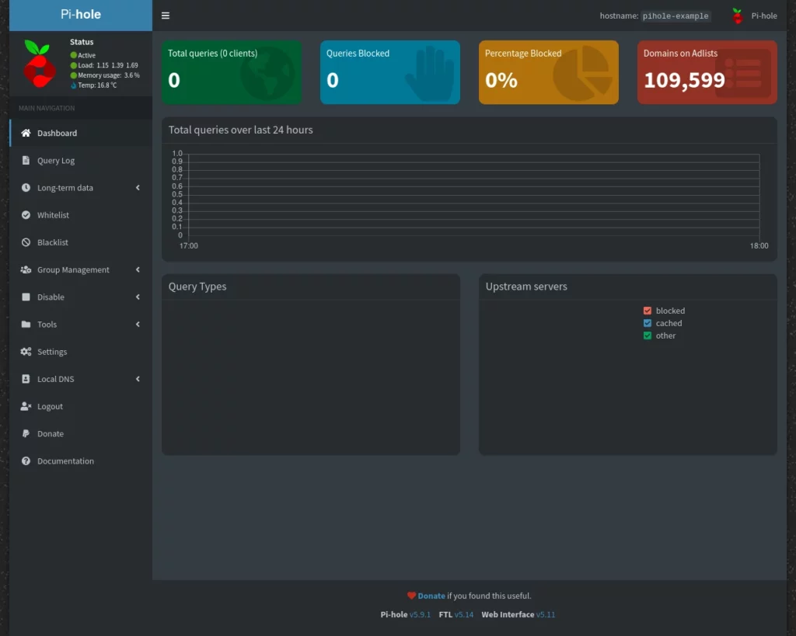
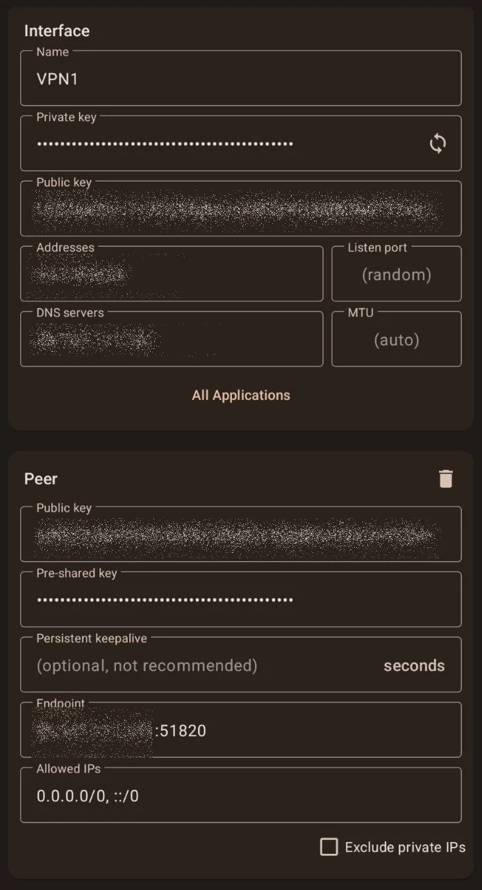

## VPN

Tutorial per il setup di una VPN self-hosted con filtro AdBlock


Questa vuole essere una guida completa per effettuare il setup di una propria VPN utilizzando Wireguard e che filtra link pubblicitari e tracker grazie ad un filtro di AdBlocking fatto con Pi-Hole.

La guida è aperta a miglioramenti e consigli, descriverò la configurazione che trovo con il miglior rapporto usabilità/privacy, non sono un esperto di reti e la guida qua presente non vi permetterá di essere magicamente anonimi e irrintracciabili.  
  
Se volete darmi consigli, contribuire alla guida o effettuare traduzioni, potete effettuare una pull request su [GitHub](https://github.com/Turtlecute33/Turtlecute.org) e supportare lo sviluppo di queste guide con una [donazione](https://priorato.btcpayserver.it/i/BFg7UG7Zu8eAaRz3EiXgQJ).  

  

## Obiettivo

L'obiettivo finale di questa guida sarà quello di self-hostarci una VPN con un filtro per ads e tracker in maniera totalmente autonoma. Questa procedura comporta dei vantaggi e svantaggi rispetto all'utilizzo di una normale VPN commerciale:

### pro

*   Non doversi fidare di un provider VPN il cui modello di business, purtroppo, spesso è vendere i nostri dati personali
*   Possibilità di inserire filtri per pubblicità e trackers; alcune VPN offrono questo servizio, ma spesso di qualità molto precaria
*   Personalizzazione dell'esperienza: volete una VPN piu veloce? Dei filtri pubblicitari specifici? Vorreste condividerla con tutta la famiglia? Con una vostra VPN potete gestirvi nel modo che preferite
*   Possibilità di scegliere la nazione e quindi anche la sede legale dei server da noleggiare (e sfruttare le migliori nazioni per privacy informatica)

### contro

*   Meno anon set sull'indirizzo IP: a meno che voi non condividiate la vostra vpn con molti familiari e amici, sarete gli unici ad utilizzare l'indirizzo IP in uscita della VPN; questo è uno svantaggio in quanto anche se esso non è direttamente collegato a voi è comunque un codice univoco che solo voi sfruttate ed usate. È quindi non ottimo per la privacy in quanto rende piu facile tracciarvi
*   Anche se non regalate dati ad un fornitore VPN, nella maggior parte dei casi farete il set-up di questo sistema su una VPS (server a noleggio), sposterete quindi il vostro trust da un fornitore commerciale di questo servizio ad uno che noleggia server (che vedrà il vostro indirizzo IP quando utilizzate la VPN). È quindi fondamentale scegliere correttamente il provider di server o eseguire questo setup su una macchina connessa ad una rete internet non instestata a voi

## Scelta dell'hosting provider

Con hosting provider s'intende l'azienda che vi fornirà il server su cui fare il set-up presente in questa guida. È fondamentale trovare un hosting con una sede legale che tutela la vostra privacy (stati interessanti possono essere quelli fuori dai 5 eyes, fuori dalla nato o che hanno buone politiche sui dati informatici. Buoni esempi sono Islanda, Svezia, Svizzera, Gibilterra, ecc), che sembra essere affidabile (non ha fatto leak di dati per piccolezze o sembra lottare per dare meno dati possibili alle autorità) e che richieda meno dati personali possibili per utilizzare il proprio servizio (pagamenti in bitcoin, dominio tor, login senza conferme telefoniche, ecc).  

In questa guida vi consiglierò un paio di hosting provider, spesso quelli piccoli o con politiche di privacy interessanti sono più costosi delle grosse hosting company. È importante guardare anche che servizi ci vengono offerti per scegliere il server più adatto alle nostre necessità (potenza, capacità e velocità di banda, ecc).  

*   [VPSbG](https://www.vpsbg.eu/aff/1e5d9e) a mio parere il miglior rapporto tra potenza, banda, privacy, usabilità e metodi di pagamento accettati. Non il più economico ma quello che offre la miglior esperienza d'uso. Server in bulgaria ed offrono 1 core con CPU AMD epyc, 1 GB di ram e 2TB di banda mensile per 8 euro al mese.
* [1984 Hosting](https://1984.hosting/) é un sito che offre vari servizi (domini, vps, dns, ecc), ha sede legale in Islanda (molto interessante per l'aspetto di Privacy informatica) e offre server con 1 core, 1 GB di ram e 1TB di banda a 100Mb/s per circa 4.50 euro oppure lo stesso server con un po' più di ram e il doppio di banda a 9 euro al mese. Penso che questo vps provider sia molto interessante, accetta pagamenti in bitcoin e il servizio clienti nelle mie esperienze passate è sempre stato abbastanza efficiente (24/48h per avere supporto).
* [Njalla](https://njal.la/) è un vecchissimo ma ancora attivo servizio di hosting, vpn, domini con sede legale a Nevis (Caraibi) e la maggior parte dei server situata in Svezia. Come prezzi è leggermente più cara di 1984 ma offre server leggermente più potenti e con un po' più di banda: 1 Core, 1.5 GB RAM, 15 GB Disk, 1.5 TB Traffic per circa 15 euro (anche qua pagabili in bitcoin). È possibile usare questo servizio anche navigando attraverso il suo dominio tor.

Esistono tanti altri servizi di VPS con differenti costi e trade-off dal punto di vista di privacy, sicurezza, costi ecc.. Potete tranquillamente fare un paio di ricerche online e non utilizzare obbligatoriamente quelli da me sopra citati.  
Una volta scelto il servizio di hosting consiglio caldamente di proseguire acquistando una macchina con sopra una distribuzione debian based (debian o ubuntu) e settando una password di accesso complessa.

## Connessione al server VPS con SSH

Come molti sapranno, per connettersi a server remoti, solitamente si utilizza SSH: un protocollo integrato nel terminale di linux con cui collegarsi a server o pc distanti. Per connetterci alla nostra VPS apriamo un terminale su un qualsiasi nostro pc e diamo il comando:  
  
`ssh [nome utente]@[indirizzo ip]`  
  
un esempio potrebbe essere: ssh root@192.34.33.256 (root è solitamente il nome utente mentre il numero seguente è l'indirizzo IP del server, solitamente è possibile trovarlo nelle informazioni della macchina da voi acquistata sul sito di hosting). Una volta dato il comando basterà inserire la password precedentemente impostata per fare l'accesso al server.  
  
Una volta connessi in SSH possiamo dare il comando:  
  
`sudo apt update && apt upgrade -y`  
  
in modo da aggiornare tutti i pacchetti del nostro sistema operativo.  
In questa guida andremo a seguire un setup per la sicurezza del nostro server semplice e minimale (in modo che si adatti a tutti gli utenti), se volete usare setup piu avanzati vi consiglio di cercare online come effettuare login sul proprio server utilizzando una chiave pubblica ssh.  
  
Andiamo infine a dare il comando:  
  
`sudo apt install fail2ban`  
  
per andare ad installare questo leggerissimo software che permette di limitare l'accesso in caso di troppe password errate sul nostro server (e quindi migliorare leggermente la sicurezza di esso).

## Setup della VPN

Ora che abbiamo effettuato tutte le procedure preliminari per rendere piú sicura e aggiornata la nostra VPS possiamo procedere al vero setup, andiamo ad installare wireguard con i seguenti comandi:  

```
curl -O https://raw.githubusercontent.com/angristan/wireguard-install/master/wireguard-install.sh
chmod +x wireguard-install.sh
./wireguard-install.sh
```

a questo punto andiamo anche ad installare pi-hole (il software che useremo come filtro pubblicitá, tracker e analytics):  
  
`curl -sSL https://install.pi-hole.net | bash`  
  
durante l'installazione scegliete come interfaccia di rete "wg0", usate l'opzione custom dns (non così importante, alla peggio la andiamo comunque a sovrascrivere dopo), abilitate la 'web interface' e salvatevi la password per il login che vi verrá data di default (ci servirá in seguito).  
  
Andiamo ora ad installare unbound, un software per avere un DNS resolver locale veloce (per fare una semplificazione ci servirá per avere il nostro setup finale completo, efficente e veloce).  
  
`sudo apt install unbound`  
  
ed andiamo a configurarlo con:  
  
`nano /etc/unbound/unbound.conf.d/pi-hole.conf`  
  
Incollate questa configurazione all'interno del file:  

```

    server:
    verbosity: 0
    interface: 127.0.0.1
    port: 5335
    do-ip4: yes
    do-udp: yes
    do-tcp: yes
    do-ip6: yes
    prefer-ip6: no
    harden-glue: yes
    harden-dnssec-stripped: yes
    use-caps-for-id: no
    edns-buffer-size: 1472
    prefetch: yes
    prefetch-key: yes
    minimal-responses: yes
    cache-min-ttl: 300
    cache-max-ttl: 86400
    serve-expired: yes
    msg-cache-size: 50m
    rrset-cache-size: 100m
    num-threads: 1
    so-reuseport: yes
    so-rcvbuf: 4m
    so-sndbuf: 4m
    private-address: 192.168.0.0/16
    private-address: 169.254.0.0/16
    private-address: 172.16.0.0/12
    private-address: 10.0.0.0/8
    private-address: fd00::/8
    private-address: fe80::/10
										
```

andiamo quindi a riavviare unbound:  
  
`sudo service unbound restart`  
  
a questo punto abbiamo correttamente prepato il dns locale, andiamo a configurare pi-hole per parlare con unbound correttamente:  
  
`nano /etc/pihole/setupVars.conf`  
  
potete editare o sostituire il vostro file di config con quello sottostante avendo accortezza di inserire i dati che nel box qua sotto ho inerito tra parentesi graffe:  
  

```

WEBPASSWORD={lasciate quella presente nel file di default}
BLOCKING_ENABLED=true
WEBUIBOXEDLAYOUT=traditional
WEBTHEME=default-dark
PIHOLE_INTERFACE=wg0
IPV4_ADDRESS={mette l'indirizzo IP della vostra VPS esempio:123.24.223.11} 
QUERY_LOGGING=true
INSTALL_WEB_SERVER=true
INSTALL_WEB_INTERFACE=true
LIGHTTPD_ENABLED=true
CACHE_SIZE=0
DNSMASQ_LISTENING=local
DNS_FQDN_REQUIRED=true
DNS_BOGUS_PRIV=true
DNSSEC=false
REV_SERVER=false
PIHOLE_DNS_1=127.0.0.1#5335

										
```

a questo punto re-buildiamo pihole con il seguente comando:  
  
`pihole -r`  

## Configurazione PiHole e AdLists

La parte a riga di comando é ormai finita, ce l'hai fatta guerriero! 🎉  
A livello teorico in questo momento é gia tutto funzionante, andiamo peró prima di utilizzare la VPN ad aggiungere dei filtri per la pubblicità!  
Aprite un browser qualsiasi e nella barra di ricerca digitate:  
  
`http://{indirizzo ip della vpn}/admin`  
esempio: http://84.177.121.221/admin  
  
A questo punto dovreste vedere la pagina di login di Pi-Hole (il nostro sistema di filtro pubblicitá, tracker e analytics). Come password dovete usare quella che ci eravamo salvati precedentemente (e che ci venive generata in fase di installazione). Una volta effettuato l'accesso avrete davanti questa schermata:  
  
 Andiamo ora nella sezione "AdLists" ed aggiungiamo delle liste di vari domain da bloccare (o meglio, il link ad alcune di queste liste). Di questo argomento si puó discorrere ore, il concetto di base é che se aggiungiamo decine di di fonti a caso bloccheremo tantissimo...troppo, andando quindi a far smettere di funzionare molti siti web o funzioni di applicazioni su nostri dispositivi. Conviene usare poche liste e tendenzialmente fatte da persone di cui ci fidiamo almeno parzialmente. Vi lascio qua sotto alcune delle principali e piu famose, in caso vogliate ampliare la sezione vi lascio l'onere di farlo in autonomia in quanto in base alle configurazioni ci potrebbero essere diversi pro o contro.  

```

https://raw.githubusercontent.com/StevenBlack/hosts/master/hosts
https://adaway.org/hosts.txt
https://v.firebog.net/hosts/AdguardDNS.txt
https://v.firebog.net/hosts/Easyprivacy.txt
https://winhelp2002.mvps.org/hosts.txt
										
```

Una volta inserite le varie blocklist muoviamoci nella sezione: tools → update gravity ed andiamo ad avviare il processo di attivazione delle varie liste. In caso di problemi con alcuni siti (io per esempio in passato con alcune liste avevo avuto problemi con i link "t.co" di twitter) basterá aggiungere il sito alla sezione "whitelist" in modo da escludero dai siti da bloccare. Ogni volta che effettuate modifiche andate poi a fare update gravity per renderle effettive.

## Esportazione delle configurazioni

Andiamo ora ad attivare la configurazione sui nostri dispositivi. Iniziamo dai telefoni:  
  
Installiamo sul nostro dispositivo l'applicazione [Wireguard](https://www.wireguard.com/install/), una volta fatto apriamo il terminale della nostra VPS e diamo il comando:  
  
`bash wireguard-install.sh`  
  
selezioniamo "add new client", diamo un nome a scelta, selezioniamo come DNS "current system resolver". Ora ci verrá mostrato un QRcode, con la nosta app mobile di wireguard andiamo a scannerizzarlo, dopo averlo fatto ci dovrebbe mostrare una schermata del genere:  



  
Nella sezione "DNS servers" andiamo ad inserire l'indirizzo ip della nostra VPS, verifichiamo che nella sezione "Endpoint" sia presente lo stesso indirizzo IP piú la scritta ":51820" che indica la porta, fatto questo ci basterá salvare e attivare la VPN!  
  
Per i pc la procedura è simile, ci basterá installare Wireguard, generare la configurazione sulla VPS (usate il comando spiegato sopra, nella procedura android), per poi copiarla nel pc:

*   Su Windows, la configurazione è da inserire nell'interfaccia grafica di Wireguard
*   Su Linux, la configurazione è da salvare in un file con estensione .conf nella cartella /etc/wireguard (ad esempio, vpn.conf), per poi attivare la VPN col comando da terminale:  
      
    `sudo wg-quick up {nome del file .conf}`  
      
    mentre per spegnerela:  
      
    `sudo wg-quick down {nome del file .conf}`

  
anche su pc, prestiamo attenzione ad avere modificato le sezioni 'DNS server' e 'Endpoint' con l'indirizzo IP del nostro server.

## Test di funzionamento

Ora che abbiamo pronta e attiva la nostra VPN andiamo a testare che funzioni tutto correttamente. Prima di tutto su un qualsiasi browser visitiamo il sito [VPN testing](https://vpntesting.com/) e avviamo un test. Verificate che tutti gli indirizzi IP e localizzazioni che vi vengono mostrate a schermo non siano quelle del vostro paese di origine ma del server VPN.  
  
Se tutto é corretto procediamo al test, non della VPN stessa, ma dell' adblocker, visitando il sito [AdBlock test](https://d3ward.github.io/toolz/adblock.html). Se il risultato finale é maggiore del 70/80% vuol dire che tutto funziona correttamente (aggiungendo piu o meno blacklist a Pi-Hole i risultati di questo test potrebbero variare). Prestate attenzione a disattivare temporaneamente eventuali estensioni di AdBlock del vostro browser per non avere risultati falsati. Anche il browser che utilizzate potrebbe influire sui risultati del test.  
  
Se entrambe le prove vengono passate correttamente sei un vero drago e sei riuscito a seguire perfettamente questa guida!! 🐉

## Conclusioni

Questo é uno dei tanti set-up possibili per crearsi una server VPN. Come ogni tipo di configurazione é possibile eseguire modifiche per adattare il servizio ai propri trade-off. Quello presentato in questa guida é, a mio parere, un buon bilanciamento tra sicurezza, funzionalitá e privacy. Se hai proposte di miglioramento, hai trovato errori puoi aiutarmi e far sentire la tua voce sul [repository github](https://github.com/Turtlecute33/Turtlecute.org).

<form style="width: 90%;" method="POST" action="https://priorato.btcpayserver.it/api/v1/invoices"
class="btcpay-form btcpay-form--block">
<input type="hidden" name="storeId"
value="71VPnrvEuzcPxNZEyEC7BRcQL7DZvZR8CCnCqNm8hphz" />
<input type="hidden" name="checkoutDesc" value="guida nodi tor" />
<input type="hidden" name="currency" value="EUR" />
<button type="submit" class="submit" name="submit"
style="min-width:209px;min-height:57px;border-radius:4px;border-style:none;background-color:#0f3b21;cursor:pointer;"
title="Pay with BTCPay Server, a Self-Hosted Bitcoin Payment Processor"><span
style="color:#fff">Donazione con</span>

</button>
</form>